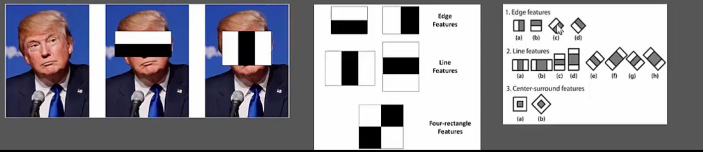

**Issues with Computer Vision**
1. Camera sensor and lens limitations
2. Viewpoint variations (side view or top view)
3. Changing Lightening conditions (outer or inside)
4. Scaling Issues (close or far)
5. Non-rigid deformations (running horses)
6. Occlusion (partly blocked images)
7. Clutter (Chameleon doubt or photo with a market backgroud)
8. Object class variations (there are so many different types of cars, glasses, beds etc.)
9. Ambiguous Images/Optical Illusions (Negative Space, Mirrage, science-model)

**Images**: 2-dimensional represenation of visible light spectrum (different wavelenghts - different colors ). <BR> 
Image gets formed when light reflects off an object onto a film, sensor or retina.<br>
Using a small opening in the barrier (called aperture), we block off most of the rays of light reducing blurring on the film or sensor. This is the **pinhole camera model**.<br>
Both eyes & camera use an adaptive lens to control:
1. Aperture Size : Controls amount of light, depth of field (bokeh)
2. Lens width: Adjusts focus distance (near or far)

**How images are stored in computers**
* OpenCV by default stores images in RGB color space (Order is BGR). Mixing different intensities of Red, Green & Blue, we can create a full color spectrum. Yellow = Red+Green
* Types of Images: 
    - Black and White Images: Stored in 2-dimensional arrays
        - Grayscale - Ranges of shades of grey
        - Binary - Pixels are either black or white 

**Color Spaces**: RGB (BGR), HSV (Hue, Saturation, Value/Brightness), CMYK
1. HSV:
    - Attempts to represent colors the way humans perceive it.
    - Stores color in cylindrical representation of RGB color points.
        - Hue - Color Value (0-179)
            - For Open-CV, otherwise we do have 359 value as well
            
            - Red (165-15)
            - Green (45-75)
            - Blue (90-120)
            
        - Saturation - Vibrancy of Color (0-255)
        
        - Value - Brightness or intensity (0-255)
    - It's useful in computer vision for color segmentation. In RGB, filtering specific colors isn't easy, however, HSV makes it much easier to set color ranges to filter specific colors we perceive them.


**Playing with OpenCV**
1. cv2.imread(<file>)
2. cv2.imshow(<LabelOfWindow>, <NumpyArrayForImage>)
3. cv2.imwrite(<NameOfFile>, <NumpyArrayForImage>)
4. cv2.cvtColor(<NumpyArrayForImage>, cv2.BGR2GRAY) #Grayscaling
5. cv2.imread(<file>, 0) #Grayscaling
<BR>**NOTE** A lot of algorithms/APIs in open-cv require you to first convert the image into gray scaled image (reason being they are easy to process as they have less information but important ones - that's why black & white TV worked fine colors were just a bonus to it but are not necessary)
6. B, G, R = image[10, 50] # BGR Values for the first 0,0 pixel
7. HSV : for color filtering
    - hsv_image = cv2.cvtColor(image, cv2.COLOR_BGR2HSV)
    - cv2.imshow('Hue channel', hsv_image[:, :, 0])
    - cv2.imshow('Saturation channel', hsv_image[:, :, 1])
    - cv2.imshow('Value channel', hsv_image[:, :, 2])# Value Channel
    
    - # Let's re-make the original image, 
    - merged = cv2.merge([B, G,R]) 
    - cv2.imshow("Merged", merged)
    
    - # Let's amplify the blue color
    - merged = cv2.merge([B+100, G, R])
    
8. Create Histograms:
    - image = cv2.imread('images/input.jpg') 
    - plt.hist(image.ravel(), 256, [0, 256]); plt.show() # for filled histograms
    - For hollow histogram shapes, find below:
        - histogram2 = cv2.calcHist([image], [0], None, [256], [0, 256]) # Second parameter [0] for blue color extraction and [1] for green and [2] for red etc.  
        - plt.plot(histogram2, color = 'b') # 'r' for red, 'g' for green
        
9. Draw Shapes:
    - cv2.line(image, (startposition), (endposition), (colors), width)
        - cv2.line(image, (0,0), (511,511), (255,127,0), 5)
    - cv2.rectangle(image, (100,100), (300,250), (127,50,127), -1) # -1 means filled
    - cv2.circle(image, (centre), Radius, (15,75,50), -1)
        - cv2.circle(image, (350, 350), 100, (15,75,50), 10)
    - Polynomial:
        - pts = np.array( [[10,50], [400,50], [90,200], [50,500]], np.int32)
        - pts = pts.reshape((-1,1,2))
        - cv2.polylines(image, [pts], True, (0,0,255), 3)
    - Extract Text:
        - cv2.putText(image, 'Hello World!', (75,290), cv2.FONT_HERSHEY_COMPLEX, 2, (100,170,0), 3)
        - Different Fonts supported are:
            - FONT_HERSHEY_SIMPLEX, FONT_HERSHEY_PLAIN
            - FONT_HERSHEY_DUPLEX,FONT_HERSHEY_COMPLEX 
            - FONT_HERSHEY_TRIPLEX, FONT_HERSHEY_COMPLEX_SMALL
            - FONT_HERSHEY_SCRIPT_SIMPLEX
            - FONT_HERSHEY_SCRIPT_COMPLEX
10. Translation:
    - T = np.float32([[1, 0, -50], [0, 1,-50]])
    - img_translation = cv2.warpAffine(image, T, (width//2, height//2))
11. Rotation: to scale & rotate at the same time
    - rotation_matrix = cv2.getRotationMatrix2D((width/2, height/2), 90, .5) #.5 is the scaling factor, 90 is anti-clockwise rotation angle (now since canvas remain the same change of shape might cause other area to be cropped or black boundary)
    - rotated_image = cv2.warpAffine(image, rotation_matrix, (width, height))
    - To avoid that cropping or black areas issues, can use below for 90 degree thing:
        - cv2.transpose(img)
        - flipped = cv2.flip(image, 0) # for 180 degree rotation
12. Interpolation:
    - Interpolation is the method of constructing new data points within the range of discrete set of known data points
    - Different Algorithms:
        - INTER_NEAREST (**Fastest**) - a nearest-neighbor interpolation 
        - INTER_LINEAR (**Good for zooming and upscaling**) - a bilinear interpolation (used by default) 
        - INTER_AREA (**Good for shrinking and downsampling**) - resampling using pixel area relation. It may be a preferred method for image decimation, as it gives moire’-free results. But when the image is zoomed, it is similar to the INTER_NEAREST method. 
        - INTER_CUBIC (**BETTER**) - a bicubic interpolation over 4x4 pixel neighborhood 
        - INTER_LANCZOS4 (**BEST**) - a Lanczos interpolation over 8x8 pixel neighborhood
    - image_scaled = cv2.resize(image, None, fx=0.75, fy=0.75)
    - img_scaled = cv2.resize(image, None, fx=2, fy=2, interpolation = cv2.INTER_CUBIC)
    - img_scaled = cv2.resize(image, (900, 400), interpolation = cv2.INTER_AREA) 
    
             
    
13. Image Pyramids:
    - smaller = cv2.pyrDown(image)
    - larger = cv2.pyrUp(smaller)
14. Edges Detection:
    -  Sobel
        - sobel_x = cv2.Sobel(image, cv2.CV_64F, 0, 1, ksize=5)
        - sobel_y = cv2.Sobel(image, cv2.CV_64F, 1, 0, ksize=5)
        - cv2.imshow('Sobel X', sobel_x)
        - cv2.imshow('Sobel Y', sobel_y)
        - sobel_OR = cv2.bitwise_or(sobel_x, sobel_y)
        - cv2.imshow('sobel_OR', sobel_OR)
    - Laplacian:
        - laplacian = cv2.Laplacian(image, cv2.CV_64F)
        - cv2.imshow('Laplacian', laplacian)
    - Canny:
        - canny = cv2.Canny(image, 50, 120)
        - cv2.imshow('Canny', canny)
15. Getting Perspective:
    - Non-Affine:
        - -# Cordinates of the 4 corners of the original image
        - points_A = np.float32([[320,15], [700,215], [85,610], [530,780]])
        - -# Cordinates of the 4 corners of the desired output
        - -# We use a ratio of an A4 Paper 1 : 1.41
        - points_B = np.float32([[0,0], [420,0], [0,594], [420,594]])
        - M = cv2.getPerspectiveTransform(points_A, points_B)
        - warped = cv2.warpPerspective(image, M, (420,594))
        - cv2.imshow('warpPerspective', warped)
    - Affine:
        - points_A = np.float32([[320,15], [700,215], [85,610]])
        - points_B = np.float32([[0,0], [420,0], [0,594]])
        - M = cv2.getAffineTransform(points_A, points_B)
        - warped = cv2.warpAffine(image, M, (cols, rows))
        - cv2.imshow('warpAffine', warped)
16. Sketch from Web-cam, live:
    `# Our sketch generating function`<BR><BR>
    `def sketch(image):`<BR>
    `    # Convert image to grayscale`<BR>
    `    img_gray = cv2.cvtColor(image, cv2.COLOR_BGR2GRAY)`<BR>
    `    # Clean up image using Guassian Blur`<BR>
    `    img_gray_blur = cv2.GaussianBlur(img_gray, (5,5), 0)`<BR>
    `    # Extract edges`<BR>
    `    canny_edges = cv2.Canny(img_gray_blur, 10, 70)`<BR>
    `    # Do an invert binarize the image`<BR> 
    `    ret, mask = cv2.threshold(canny_edges, 70, 255, cv2.THRESH_BINARY_INV)`<BR>
    `    return mask`<BR>
<BR>    
    `cap = cv2.VideoCapture(0)`<BR>
<BR>
    `while True:`<BR>
    `    ret, frame = cap.read()`<BR>
    `    cv2.imshow('Our Live Sketcher', sketch(frame))`<BR>
    `    if cv2.waitKey(1) == 13: #13 is the Enter Key`<BR>
    `        break`<BR>
<BR>            
    `-# Release camera and close windows`<BR>
    `cap.release()`<BR>
    `cv2.destroyAllWindows()`<BR>
    
17. Contours: [More about contours - area, centroid, fitting circle or line etc](https://docs.opencv.org/3.4.2/dd/d49/tutorial_py_contour_features.html)
    -  Find & draw contours:
        - `gray = cv2.cvtColor(image,cv2.COLOR_BGR2GRAY)`    
        - `edged = cv2.Canny(gray, 30, 200)`    
        - `# Use a copy of your image e.g. edged.copy(), since findContours alters the image`    
        - `image, contours, hierarchy = cv2.findContours(edged, cv2.RETR_EXTERNAL, cv2.CHAIN_APPROX_NONE)`
            - 'hierarchy' describes the child-parent relationships between contours (i.e. contours within contours)
            - Approximation Methods (3rd Parameter):
                - cv2.CHAIN_APPROX_NONE: 
                    - stores all the boundary points. 
                    - But we don't necessarily need all bounding points. 
                    - If the points form a straight line, we only need the start and ending points of that line.
                - cv2.CHAIN_APPROX_SIMPLE: 
                    - instead only provides these start and end points of bounding contours.
                    - Thus resulting in much more efficent storage of contour information.
            - Retrieval Modes (Hierarchy Types): https://opencv-python-tutroals.readthedocs.io/en/latest/py_tutorials/py_imgproc/py_contours/py_contours_hierarchy/py_contours_hierarchy.html#contours-hierarchy
                - cv2.RETR_LIST: Retrieves all contours
                - cv2.RETR_EXTERNAL: Retrieves external or outer contours only
                - cv2.RETR_CCOMP: Retrieves all in a 2-level hierarchy
                - cv2.RETR_TREE: Retrieves all in full hierarchy
                - cv2.RETR_FLOODFILL: 
        - `# Use '-1' as the 3rd parameter to draw all`    
        - `cv2.drawContours(image, contours, -1, (0,255,0), 3)` 
    
    - Sorting Contours:
        - By Area:
          ```python
              area = cv2.contourArea(contour_from_contour_list_we_get_from_findContours_method)
              
              #Sort contours large to small, above line is just to get area, but not required for below sorting
              sorted_contours = sorted(contours, key=cv2.contourArea, reverse=True)
          ```
  
        - By spatial position (LEFT-to-RIGHT): **OPEN-CV left topmost point is 0,0**
          ```python
            def x_cord_contour(contours):
                #Returns the X cordinate for the contour centroid
                if cv2.contourArea(contours) > 10:
                    M = cv2.moments(contours)
                    return (int(M['m10']/M['m00']))
            
            
            def label_contour_center(image, c):
                # Places a red circle on the centers of contours
                M = cv2.moments(c)
                cx = int(M['m10'] / M['m00'])
                cy = int(M['m01'] / M['m00'])
                # Draw the countour number on the image
                cv2.circle(image,(cx,cy), 10, (0,0,255), -1)
                return image
            
            # Labeling Contours left to right
            for (i,c)  in enumerate(contours_left_to_right):
                cv2.drawContours(orginal_image, [c], -1, (0,0,255), 3)  
                M = cv2.moments(c)
                cx = int(M['m10'] / M['m00'])
                cy = int(M['m01'] / M['m00'])
                cv2.putText(orginal_image, str(i+1), (cx, cy), cv2.FONT_HERSHEY_SIMPLEX, 1, (0, 255, 0), 2)
                cv2.imshow('6 - Left to Right Contour', orginal_image)
                cv2.waitKey(0)
                (x, y, w, h) = cv2.boundingRect(c)
                # Let's now crop each contour and save these images
                cropped_contour = orginal_image[y:y + h, x:x + w]
                image_name = "output_shape_number_" + str(i+1) + ".jpg"
                print(image_name)
                # cv2.imwrite(image_name, cropped_contour)
                cv2.imshow(image_name, cropped_contour)
          ```
    - Approximate Contours + Convex Hull:-
        - **cv2.approxPolyDP(contour, Approximation Accuracy, Closed)**
            - **contour** – is the individual contour we wish to approximate
            - **Approximation Accuracy** – Important parameter is determining the accuracy of the approximation. Small values give precise-  approximations, large values give more generic approximation. A good rule of thumb is less than 5% of the contour perimeter
            - **Closed** – a Boolean value that states whether the approximate contour should be open or closed
        ```python
              _, contours, hierarchy = cv2.findContours(thresh.copy(), cv2.RETR_LIST, cv2.CHAIN_APPROX_NONE)
              # Iterate through each contour and compute the approx contour
              for c in contours:
                  # Calculate accuracy as a percent of the contour perimeter
                  accuracy = 0.03 * cv2.arcLength(c, True)
                  approx = cv2.approxPolyDP(c, accuracy, True)
                  cv2.drawContours(image, [approx], 0, (0, 255, 0), 2)
                  cv2.imshow('Approx Poly DP', image)
        ```
        - **Convex Hull**:
        ```python
              _, contours, hierarchy = cv2.findContours(thresh.copy(), cv2.RETR_LIST, cv2.CHAIN_APPROX_NONE)
              # Sort Contours by area and then remove the largest frame contour
              n = len(contours) - 1
              contours = sorted(contours, key=cv2.contourArea, reverse=False)[:n]
              # Iterate through contours and draw the convex hull
              for c in contours:
                  hull = cv2.convexHull(c)
                  cv2.drawContours(image, [hull], 0, (0, 255, 0), 2)
                  cv2.imshow('Convex Hull', image)
        ``` 
18. Shape Matching: (Shape can be identified by number of minimum points to remember contour or approxPolyDP)
    - **cv2.matchShapes(contour template, contour, method, method parameter)**
    - **Output** – match value (lower values means a closer match)
        - **Contour Template** – This is our reference contour that we’re trying to find in the new image
        - **Contour** – The individual contour we are checking against
        - **Method** – Type of contour matching (1, 2, 3) [More Details here](http://docs.opencv.org/2.4/modules/imgproc/doc/structural_analysis_and_shape_descriptors.html)
        - **Method** Parameter – leave alone as 0.0 (not fully utilized in python OpenCV)
    ```python
            # Find contours in template
            _, contours, hierarchy = cv2.findContours(thresh1, cv2.RETR_CCOMP, cv2.CHAIN_APPROX_SIMPLE)
            
            # We need to sort the contours by area so that we can remove the largest
            # contour which is the image outline
            sorted_contours = sorted(contours, key=cv2.contourArea, reverse=True)
            
            # We extract the second largest contour which will be our template contour
            template_contour = contours[1]
            
            # Extract contours from second target image
            _, contours, hierarchy = cv2.findContours(thresh2, cv2.RETR_CCOMP, cv2.CHAIN_APPROX_SIMPLE)
            
            for c in contours:
                # Iterate through each contour in the target image and 
                # use cv2.matchShapes to compare contour shapes
                match = cv2.matchShapes(template_contour, c, 1, 0.0)
                print(match)
                # If the match value is less than 0.15 we
                if match < 0.15:
                    closest_contour = c
                else:
                    closest_contour = [] 
                            
            cv2.drawContours(target, [closest_contour], -1, (0,255,0), 3)
            cv2.imshow('Output', target)
    ```
19. Line Detection:
    - **cv2.HoughLines**(binarized/thresholded image, 𝜌 accuracy, 𝜃 accuracy, threshold)
        - Threshold here is the minimum vote for it to be considered a line
        ```python
                # Grayscale and Canny Edges extracted
                gray = cv2.cvtColor(image, cv2.COLOR_BGR2GRAY)
                edges = cv2.Canny(gray, 100, 170, apertureSize = 3)
                #cv2.imshow("Canny",edges)
                
                # Run HoughLines using a rho accuracy of 1 pixel
                # theta accuracy of np.pi / 180 which is 1 degree
                # Our line threshold is set to 240 (number of points on line)
                lines = cv2.HoughLines(edges, 1, np.pi / 180, 240)
                
                # We iterate through each line and convert it to the format
                # required by cv.lines (i.e. requiring end points)
                for rho, theta in lines[0]:
                    a = np.cos(theta)
                    b = np.sin(theta)
                    x0 = a * rho
                    y0 = b * rho
                    x1 = int(x0 + 1000 * (-b))
                    y1 = int(y0 + 1000 * (a))
                    x2 = int(x0 - 1000 * (-b))
                    y2 = int(y0 - 1000 * (a))
                    cv2.line(image, (x1, y1), (x2, y2), (255, 0, 0), 2)
                
                cv2.imshow('Hough Lines', image)
                cv2.waitKey(0)
                cv2.destroyAllWindows()
        ```
    - **cv2.HoughLinesP**(binarized image, 𝜌 accuracy, 𝜃 accuracy, threshold, minimum line length, max line gap)
        ```python
                # Grayscale and Canny Edges extracted
                image = cv2.imread('images/soduku.jpg')
                gray = cv2.cvtColor(image, cv2.COLOR_BGR2GRAY)
                edges = cv2.Canny(gray, 100, 170, apertureSize = 3)
                
                # Again we use the same rho and theta accuracies
                # However, we specific a minimum vote (pts along line) of 100
                # and Min line length of 5 pixels and max gap between lines of 10 pixels
                lines = cv2.HoughLinesP(edges, 1, np.pi / 180, 200, 5, 10)
                print(lines.shape)
                
                for x1, y1, x2, y2 in lines[0]:
                    cv2.line(image, (x1, y1), (x2, y2),(0, 255, 0), 3)
                
                cv2.imshow('Probabilistic Hough Lines', image)
                cv2.waitKey(0)
                cv2.destroyAllWindows()
        ```
        
**Image Manipulation**:
1. **Transformations**:
    - Geometric distortions enacted upon an image
    - Used to correct distortions or perspective issues from arising from the point of view an image was captured.
    - Types (different categories of classification but we will talk about main):
        - Affine: Scaling, Rotation, Translation
        - Non-Affine: (Projective Transformation or Homography)
            - It doesn't preserve parallelism, length and angle. It does however preserve collinearity and incidence (two adjacent point will remain adjacent.)
            - Mainly because of different camera perspectives.
2. **Edge Detections**:
    - Very important especially when dealing with contours.
    - Edges can be defined as sudden changes (discontinuities) in an image and they can encode just as much information as pixels. These capture important information generally sufficient to identify an object but scenarios could be complex.
    
    - Types of algorithms:
        - Sobel: to emphasize vertical or horizontal edges
        - Laplacian: Gets all orientations
        - Canny: Optimal due to low error rate, well defined edges and accurate detection.
    - Canny Algorithm:
        - Applies Gaussian blurring
        -  Finds intensity gradient of the image
        - Applied non-maximum suppression (i.e removes pixels that are not edges)
        - Hysteresis - Applies thresholds (i.e if pixel is within the upper and lower thresholds, it is considered an edge)
3. **Image Segmentation**
    - Partitioning images into different regions.
    - Different Techniques:
        - Contours: Are continuous lines or curves that bound or cover the full boundary of an object in an image.
            - Very important in : Object Detection, Shape Analysis
            - Open-CV's findContours require gray-scale image otherwise it will throw an error.
                - findContours doesn't require image to be passed to Canny Algorithm but if passed it will remove a lot of noise and hence let to easy processing (can help to reduce the number of unnecessary contours).
                - open-cv stores contours as a list of list. List contour1 stores all the points of one contour as a list for example.
            - **Sorting Contours**:
                - **Sorting by Area** can assist in Object Recognition (using contours area).
                    - Eliminate small contours that may be noise.
                    - Extract the largest contour
                - **Sorting by spatial position**: using the contours centroid
                    - Sort characters left to right.
                    - Process images in specific order.
                - It is usually a good technique to find contours and draw it on a blank white or black backgroud.
        - Line Detection
            
                
            - open-cv stores line as per above equation where 
                - p is the perpendicular distance from origin
                - theta is the angle formed by the normal of this line to the origin
            - Two types of algorithms:
                - Hough Lines: Threshold is the minimum vote to be considered a line
                - Probabilitic Hough Lines:
                    - Idea is that it takes only a random subset of points sufficient enough for line detection.
                    - Also returns the start and end points of the line unlike the previous function.
            
        - Circle Detection
        - Blob Detection:
            - Blobs can be described as groups of connected pixels that all share a common property.
            - Steps for open-cv:
                - Create Detector
                - Input image into Detector
                - Obtain key points
                - Draw key points
            ```python
                    # Read image
                    image = cv2.imread("images/Sunflowers.jpg")
                     
                    # Set up the detector with default parameters.
                    detector = cv2.SimpleBlobDetector_create()
                     
                    # Detect blobs.
                    keypoints = detector.detect(image)
                     
                    # Draw detected blobs as red circles.
                    # cv2.DRAW_MATCHES_FLAGS_DRAW_RICH_KEYPOINTS ensures the size of
                    # the circle corresponds to the size of blob
                    blank = np.zeros((1,1)) 
                    blobs = cv2.drawKeypoints(image, keypoints, blank, (0,255,255),
                                                          cv2.DRAW_MATCHES_FLAGS_DEFAULT)
                     
                    # Show keypoints
                    cv2.imshow("Blobs", blobs)
                    cv2.waitKey(0)
                    cv2.destroyAllWindows()
            ```
            
            - The function **cv2.drawKeypoints** takes the following arguments:
                - **cv2.drawKeypoints**(input image, keypoints, blank_output_array, color, flags)
                - flags:
                    - **cv2.DRAW_MATCHES_FLAGS_DEFAULT**
                    - **cv2.DRAW_MATCHES_FLAGS_DRAW_RICH_KEYPOINTS**
                    - **cv2.DRAW_MATCHES_FLAGS_DRAW_OVER_OUTIMG**
                    - **cv2.DRAW_MATCHES_FLAGS_NOT_DRAW_SINGLE_POINTS**
                    
            - Detect ellipses:
            ```python
                      # Intialize the detector using the default parameters
                      detector = cv2.SimpleBlobDetector_create()
                         
                      # Detect blobs
                      keypoints = detector.detect(image)
                         
                      # Draw blobs on our image as red circles
                      blank = np.zeros((1,1)) 
                      blobs = cv2.drawKeypoints(image, keypoints, blank, (0,0,255), cv2.DRAW_MATCHES_FLAGS_DRAW_RICH_KEYPOINTS)
            
                      number_of_blobs = len(keypoints)
                      text = "Total Number of Blobs: " + str(len(keypoints))
                      cv2.putText(blobs, text, (20, 550), cv2.FONT_HERSHEY_SIMPLEX, 1, (100, 0, 255), 2)
            
                      # Display image with blob keypoints
                      cv2.imshow("Blobs using default parameters", blobs)
                      cv2.waitKey(0)
            ```
            - Detect ellipses and circles separately:
            ```python
                        # Set our filtering parameters
                        # Initialize parameter settiing using cv2.SimpleBlobDetector
                        params = cv2.SimpleBlobDetector_Params()
                        
                        # Set Area filtering parameters
                        params.filterByArea = True
                        params.minArea = 100
                        
                        # Set Circularity filtering parameters
                        params.filterByCircularity = True 
                        params.minCircularity = 0.9
                        
                        # Set Convexity filtering parameters
                        params.filterByConvexity = False
                        params.minConvexity = 0.2
                            
                        # Set inertia filtering parameters
                        params.filterByInertia = True
                        params.minInertiaRatio = 0.01
                        
                        # Create a detector with the parameters
                        detector = cv2.SimpleBlobDetector_create(params)
                            
                        # Detect blobs
                        keypoints = detector.detect(image)
                        
                        # Draw blobs on our image as red circles
                        blank = np.zeros((1,1)) 
                        blobs = cv2.drawKeypoints(image, keypoints, blank, (0,255,0), cv2.DRAW_MATCHES_FLAGS_DRAW_RICH_KEYPOINTS)
                        
                        number_of_blobs = len(keypoints)
                        text = "Number of Circular Blobs: " + str(len(keypoints))
                        cv2.putText(blobs, text, (20, 550), cv2.FONT_HERSHEY_SIMPLEX, 1, (0, 100, 255), 2)
            ```
            - Blob filtering shape & size: **cv2.SimpleBlobDetector_Params()**
                - Area: (to see all blobs having area in given range)
                    - params.filterByArea=True/False
                    - params.minArea = pixels
                    - params.maxArea = pixels
                - Circularity: ()
                    - params.filterByCircularity = True/False
                    - params.minCircularity = 1 being perfect circle, 0 the opposite
                - Convexity: (Area of blob **divide** Area of Convex Hull)
                    - params.filterByConvexity = True/False
                    - params.minConvexity= 0 to 1
                - Inertia: Measure of ellipticalness (low being more elliptical, high being more circular)
                    - params.filterByInertia = True/False
                    - params.minInertiaRatio = 0.01 (high means more circular)                

4. **Object Detection**:
    - Object Detection using Template Matching
        - Applications / Use-Cases:
            - Labeling Scenes
            - Robot Navigation
            - Self Driving Cars
            - Body Recognition
            - Disease & Cancer Detection
            - Facial Recognition
            - Handwriting Recognition
            - Identifying objects in satellite images
        - Object Detection (object found or not) vs Recognition (which object is this):
        - Template Matching:
            - Slides a template image across a source image until the match found. [Differnt Algorithms Details](http://docs.opencv.org/2.4/modules/imgproc/doc/object_detection.html)
              ```python
                    # Load input image and convert to grayscale
                    image = cv2.imread('images/WaldoBeach.jpg')
                    gray = cv2.cvtColor(image, cv2.COLOR_BGR2GRAY)
                    # Load Template image
                    template = cv2.imread('images/waldo.jpg',0)
                    result = cv2.matchTemplate(gray, template, cv2.TM_CCOEFF)
                    min_val, max_val, min_loc, max_loc = cv2.minMaxLoc(result)
                    #Create Bounding Box
                    top_left = max_loc
                    bottom_right = (top_left[0] + 50, top_left[1] + 50)
                    cv2.rectangle(image, top_left, bottom_right, (0,0,255), 5)
                    cv2.imshow('Where is Waldo?', image)
              ```
            - **cv2.matchTemplate**: This function takes a “sliding window” of our waldo query image and slides it across our puzzle image from left to right and top to bottom, one pixel at a time. Then, for each of these locations, we compute the correlation coefficient to determine how “good” or “bad” the match is. Regions with sufficiently high correlation can be considered “matches” for our waldo template.
            - **Issues with Template Matching**: - Solution - **Image Features**
                - Rotation
                - Size
                - Photometric changes (eg. brightness, contrast, hue etc.)
                - Distortions from view point changes (Affine/Non-Affine)
    - Mini-Project: Finding Waldo
    - Feature description Theory
        - Image Features are interesting areas of an image that are somewhat unique to that specific image. They are also popularly called as **key point features** or **interest points**.
            
        - **Why Important**:
            - Very useful to analyze, describe and match images.
            - Used for:
                - Image Alignment. eg- Panorama Stitching (finding corresponding matches so we can stitch images together)
                - 3D Reconstruction
                - Robot Navigation
                - Object Recognition
                - Motion Tracking
         - **But what defines interesting**?
            - Interesting areas carry a lot of distinct & unique information at that point.
                - High change of intensity
                - Corners or edges
            - **Be careful that noise can appear "INFORMATIVE" when it is not. So one should first try to remove noise before capturing/finding key points features**.
         - **Characteristics of interesting features**:
                
            - **Repeatable** - can be found in multiple pictures of the same scene
            - **Distinctive** - unique/different to other features of the same scene
            - **Compactness/Efficiency** - significantly less features than pixels in the image
            - **Locality** - must occupy a small area of the image and is robust to clutter and occlusion.
         - Different Open-CV algorithm:
            - Corners as Features:
                - Corners are identified when shifting a window in any direction over that point gives a large change in intensity.
                    - **Flat**: No Change in any direction.
                    - **Edge**: Change in one direction.
                    - **Corner**: Change in all directions.
                
                - Algorithms for Edge Detection:
                    - **Harris Corner**
                        - **cv2.cornerHarris**(input image, block size, ksize, k)**
                            - Input image - should be grayscale and float32 type.
                            - blockSize - the size of neighborhood considered for corner detection
                            - ksize - aperture parameter of Sobel derivative used.
                            - k - harris detector free parameter in the equation
                            - **Output** – array of corner locations (x,y)
                        ```python
                            image = cv2.imread('images/chess.jpg')
                            gray = cv2.cvtColor(image, cv2.COLOR_BGR2GRAY)
                            # The cornerHarris function requires the array datatype to be float32
                            gray = np.float32(gray)
                            harris_corners = cv2.cornerHarris(gray, 3, 3, 0.05)
                            kernel = np.ones((7,7),np.uint8)
                            harris_corners = cv2.dilate(harris_corners, kernel, iterations = 2)
                            # Threshold for an optimal value, it may vary depending on the image.
                            image[harris_corners > 0.025 * harris_corners.max() ] = [255, 127, 127]
                            cv2.imshow('Harris Corners', image)
                        ```
                    - GoodFeatureToTrack: Improved Corner Detection
                        - **cv2.goodFeaturesToTrack**(input image, maxCorners, qualityLevel, minDistance)**
                            - Input Image - 8-bit or floating-point 32-bit, single-channel image.
                            - maxCorners – Maximum number of corners to return. If there are more corners than are found, the strongest of them is returned.
                            - qualityLevel – Parameter characterizing the minimal accepted quality of image corners. The parameter value is multiplied by the best corner quality measure (smallest eigenvalue). The corners with the quality measure less than the product are rejected. For example, if the best corner has the quality measure = 1500, and the  qualityLevel=0.01 , then all the corners with the quality - - measure less than 15 are rejected.
                            - minDistance – Minimum possible Euclidean distance between the returned corners.
                        ```python
                                img = cv2.imread('images/chess.jpg')
                                gray = cv2.cvtColor(img,cv2.COLOR_BGR2GRAY)
                                # We specific the top 7 corners
                                corners = cv2.goodFeaturesToTrack(gray, 7, 0.01, 150)
                                for corner in corners:
                                x, y = corner[0]
                                x = int(x)
                                y = int(y)
                                cv2.rectangle(img,(x-10,y-10),(x+10,y+10),(0,255,0), 2)
                                cv2.imshow("Corners Found", img)
                        ```
                - Problems with corner as features: Solution:  **SIFT**
                    - Corner matching in images is tolerant of:
                        - Rotations
                        - Translations (i.e. shifts in image)
                        - Slight photometric changes e.g. brightness or affine intensity
                    - However, it is intolerant of:
                        - Large changes in the intensity or photometric changes
                        - Scaling (i.e enlarging or shrinking)
                        
                        
                - Solutions for above problems:
                    - **SIFT**: (Scale Invariant Feature Transform) [Link](http://www.inf.fu-berlin.de/lehre/SS09/CV/uebungen/uebung09/SIFT.pdf) [pip install opencv-contrib-python]
                        - Introduction
                            - widely used (although patented) in computer vision (very well solve **scale invariant issue**)
                            - Patented, no longer freely available in OPEN-CV 3.0+
                        - Working:
                            - Detects **interesting key points** in an image using the **Difference of Gaussian method**.
                            - These are the areas of the image where variation exceeds a certain threshold and are better than edge descriptors.
                            - Then we need to **create vector descriptor** for these interesting areas. Scale invariance is achieved via the following process:-
                                - Interest points are scanned at **several different scales**.
                                - The scale at which we meet a **specific stability criteria**, is then selected and is encoded by the vector descriptor. Therefore, regardless of the initial size, the more stable scale is found which allows us to be scale invariant.
                            - Rotation invariance is achieved by obtaining the Orientation Assignment of the key point using image gradient magnitudes. Once we know the 2D direction, we can normalize this direction.
                            - [Full Paper of shift](https://www.cs.ubc.ca/~lowe/papers/ijcv04.pdf)
                            - [Excellent Tutorial on SIFT](https://opencv-python-tutroals.readthedocs.io/en/latest/py_tutorials/py_feature2d/py_sift_intro/py_sift_intro.html) 
                            
                            
                            <BR>
                            
                            
                        ```python
                                image = cv2.imread('images/input.jpg')
                                gray = cv2.cvtColor(image, cv2.COLOR_BGR2GRAY)
                                #Create SIFT Feature Detector object
                                sift = cv2.SIFT()
                                #Detect key points
                                keypoints = sift.detect(gray, None)
                                print("Number of keypoints Detected: ", len(keypoints))
                                image = cv2.drawKeypoints(image, keypoints, flags=cv2.DRAW_MATCHES_FLAGS_DRAW_RICH_KEYPOINTS)
                                cv2.imshow('Feature Method - SIFT', image)
                        ```
                            
                    - **SURF**: (Speed Up Robust Features): [Link](http://www.vision.ee.ethz.ch/~surf/eccv06.pdf)
                        - SIFT is quite effective but computation expensive
                        - SURF was developed to improve the speed of a scale invariant feature descriptor
                        - Instead of using the Difference of Gaussian approach, SURF uses Hessian matrix approximation to detect interesting points and use the sum of Haar wavelet responses for orientation.
                    
                        ```python
                                image = cv2.imread('images/input.jpg')
                                gray = cv2.cvtColor(image, cv2.COLOR_BGR2GRAY)
                                #Create SURF Feature Detector object
                                surf = cv2.SURF()
                                # Only features, whose hessian is larger than hessianThreshold are retained by the detector
                                surf.hessianThreshold = 500
                                keypoints, descriptors = surf.detectAndCompute(gray, None)
                                image = cv2.drawKeypoints(image, keypoints, flags=cv2.DRAW_MATCHES_FLAGS_DRAW_RICH_KEYPOINTS)
                                cv2.imshow('Feature Method - SURF', image)
                        ```
                    
                    - **Alternatives of SIFT & SURF**: (free to use): 
                        - **FAST**: (Features from accelerated Segment Test): [Link1](https://www.edwardrosten.com/work/rosten_2006_machine.pdf) [Link2-PDF](http://homepages.inf.ed.ac.uk/rbf/CVonline/LOCAL_COPIES/AV1011/AV1FeaturefromAcceleratedSegmentTest.pdf)
                            - key point detection only (no descriptor, we can use SIFT or SURF to compute that)
                            - used in real time applications.
                            ```python
                                    image = cv2.imread('images/input.jpg')
                                    gray = cv2.cvtColor(image, cv2.COLOR_BGR2GRAY)
                                    # Create FAST Detector object
                                    fast = cv2.FastFeatureDetector()
                                    # Obtain Key points, by default non max suppression is On
                                    # to turn off set fast.setBool('nonmaxSuppression', False)
                                    keypoints = fast.detect(gray, None)
                                    print("Number of keypoints Detected: ", len(keypoints))
                                    # Draw rich keypoints on input image
                                    image = cv2.drawKeypoints(image, keypoints, flags=cv2.DRAW_MATCHES_FLAGS_DRAW_RICH_KEYPOINTS)
                                    cv2.imshow('Feature Method - FAST', image)
                            ```
                            
                        - **BRIEF**: (Binary Robust Independent Elementary Features): [Details Here](http://cvlabwww.epfl.ch/~lepetit/papers/calonder_pami11.pdf)
                            - Computers descriptors quickly (instead of using SIFT or SURF)
                            - Fast
                            ```python
                                image = cv2.imread('images/input.jpg')
                                gray = cv2.cvtColor(image, cv2.COLOR_BGR2GRAY)
                                # Create FAST detector object
                                fast = cv2.FastFeatureDetector()
                                # Create BRIEF extractor object
                                brief = cv2.DescriptorExtractor_create("BRIEF")
                                # Determine key points
                                keypoints = fast.detect(gray, None)
                                # Obtain descriptors and new final keypoints using BRIEF
                                keypoints, descriptors = brief.compute(gray, keypoints)
                                image = cv2.drawKeypoints(image, keypoints, flags=cv2.DRAW_MATCHES_FLAGS_DRAW_RICH_KEYPOINTS)
                                cv2.imshow('Feature Method - BRIEF', image)
                            ```
                            
                        - **ORB**: (Oriented FAST and ROTATED BRIEF) - developed by open-cv :(free)
                            - combines both FAST and BRIEF
                            - [More details on ORB](https://www.willowgarage.com/sites/default/files/orb_final.pdf)
                            ```python
                                image = cv2.imread('images/input.jpg')
                                gray = cv2.cvtColor(image, cv2.COLOR_BGR2GRAY)
                                # Create ORB object, we can specify the number of key points we desire
                                orb = cv2.ORB()
                                # Determine key points
                                keypoints = orb.detect(gray, None)
                                # Obtain the descriptors
                                keypoints, descriptors = orb.compute(gray, keypoints)
                                image = cv2.drawKeypoints(image, keypoints,flags=cv2.DRAW_MATCHES_FLAGS_DRAW_RICH_KEYPOINTS)
                                cv2.imshow('Feature Method - ORB', image)
                            ```
                            
                    - Steps of these algorithms:
                        - Create Detector
                        - Input image into Detector
                        - Obtain Key points
                        - Draw key points
                                [11_SIFT_SURF_FAST_ORB_Steps.jpg](images/11_SIFT_SURF_FAST_ORB_Steps.jpg)
                            
    - Finding Corners
    - SIFT, SURF, FAST, BREIF & ORB
    - Mini-Project: Object Detection using Features **PENDING**
    - Histogram of Gradients (HoG) as a Descriptor: [Link1](http://stackoverflow.com/questions/6090399/get-hog-image-features-from-opencv-python), [Link2](http://www.juergenwiki.de/work/wiki/doku.php?id=public:hog_descriptor_computation_and_visualization)
        - Feature Descriptor widely used for object detection.
        - Represents objects as single feature vector as opposed to a set of feature vectors where each represents a segment of the image.
        - Computed by sliding window detector over an image, where a HOG descriptor is computed for each position. Like SIFT scale of the image is adjusted (pyramiding)
        - Are often used with SVM classifiers. Each HOG descriptor that is computed is fed to a SVM classifier to determine if the object is found or not.
    - **Steps**:
        - Using an 8 X 8 pixel detection window or cell (in green), we compute the gradient vector or edge orientations at each pixel.
        - This generates 64 (8X8) gradient vectors which are then represented as histogram.
        - Each cell is then split into angular bins, where each bin corresponds to a gradient direction (eg. x,y). In the Dalal and Triggs paper, they used 9 bins 0-180 degree (20 degree each bin)
        - This effectively reduces 64 vectors to just 9 values.
        - As it stores gradient magnitudes, it's relatively immune to deformations.
        - We then **Normalize** the gradients to ensure invariance to illumination changes i.e. Brightness and Contrast. Eg. in the images below, if we divide the vectors by the gradient magnitudes we get 0.707 for all, this is normalization.
        
        - Instead of individual window cell normalization, a method called **Block Normalization** is used. This takes into account neighboring blocks so we normalize taking into consideration larger segments of the image.
        
        ```python
            image = cv2.imread('images/elephant.jpg')
            gray = cv2.cvtColor(image, cv2.COLOR_BGR2GRAY)
            # h x w in pixels
            cell_size = (8, 8) 
             # h x w in cells
            block_size = (2, 2) 
            # number of orientation bins
            nbins = 9
            # Using OpenCV's HOG Descriptor
            # winSize is the size of the image cropped to a multiple of the cell size
            hog = cv2.HOGDescriptor(_winSize=(gray.shape[1] // cell_size[1] * cell_size[1],
                                              gray.shape[0] // cell_size[0] * cell_size[0]),
                                    _blockSize=(block_size[1] * cell_size[1],
                                                block_size[0] * cell_size[0]),
                                    _blockStride=(cell_size[1], cell_size[0]),
                                    _cellSize=(cell_size[1], cell_size[0]),
                                    _nbins=nbins)
            # Create numpy array shape which we use to create hog_feats
            n_cells = (gray.shape[0] // cell_size[0], gray.shape[1] // cell_size[1])
            # We index blocks by rows first.
            # hog_feats now contains the gradient amplitudes for each direction,
            # for each cell of its group for each group. Indexing is by rows then columns.
            hog_feats = hog.compute(gray).reshape(n_cells[1] - block_size[1] + 1,
                                    n_cells[0] - block_size[0] + 1,
                                    block_size[0], block_size[1], nbins).transpose((1, 0, 2, 3, 4))  
            # Create our gradients array with nbin dimensions to store gradient orientations 
            gradients = np.zeros((n_cells[0], n_cells[1], nbins))
            # Create array of dimensions 
            cell_count = np.full((n_cells[0], n_cells[1], 1), 0, dtype=int)
            # Block Normalization
            for off_y in range(block_size[0]):
                for off_x in range(block_size[1]):
                    gradients[off_y:n_cells[0] - block_size[0] + off_y + 1,
                              off_x:n_cells[1] - block_size[1] + off_x + 1] += \
                        hog_feats[:, :, off_y, off_x, :]
                    cell_count[off_y:n_cells[0] - block_size[0] + off_y + 1,
                               off_x:n_cells[1] - block_size[1] + off_x + 1] += 1
            # Average gradients
            gradients /= cell_count
            # Plot HOGs using Matplotlib
            # angle is 360 / nbins * direction
            color_bins = 5
            plt.pcolor(gradients[:, :, color_bins])
            plt.gca().invert_yaxis()
            plt.gca().set_aspect('equal', adjustable='box')
            plt.colorbar()
            plt.show()
        ```
        

5. **Face, People & Car Detection**:
    - Understanding HAAR Cascade Classifiers:
        - As previously discussed, we can extract features from an image and use those features to classify objects.
        - **HAAR Cascade Classifier** is an object detection method that inputs *HAAR Features* into a series of classifiers (cascade) to identify objects in an image. They are trained to identify one type of object, however, we can use several of them in parallel e.g. detecting eyes and faces together.
        - **Some details**:
            - HAAR Classifier are trained using lots of positive image (i.e images with the object present - say 500 images) and negative image (i.e images without the object present - say 1000 images).
            - We then extract features using **sliding windows of rectangular blocks**. These features are single valued and are calculated by subtracting the sum of pixel intensities under the white rectangles from the black rectangles.
            
             
            - However this is a ridiculous calculations overhead even for a base window of 24X24 pixels(180,000 features generated). So the researchers devised a method called **Integral Images** that computed this with four array references. This is much much faster.
            - However, they still had 180,000 features and the majority of them added no real value.
            
            - **Boosting** was then used to determine the most informative features with *AdaBoost* algorithm of choice due to it's ease of implementation. Boosting is the process by which we use weak classifiers to build strong classifiers, simply by assigning heavier weighted penalties on incorrect classifications. Reducing the 180,000 features to 6000, which is still quite a bit features.
            - Since 6000 is still a big number, what if we use the most informative features to first check whether the region can potentially have a face (false positive will be no big deal). Doing so eliminates the need for calculating all 6000 features at once for a given image.
            
            - This concept is called the **Cascade of classifiers** - for face detection, the Viola Jones method used 38 stages.
            
    - Face & Eye Detection:
        - OpenCV provides few pre-trained classifiers in the form of .xml files (that are quite useful - please checkout [here](https://github.com/opencv/opencv/tree/master/data/haarcascades))
        - Flow of Cascade Classifiers:
            - Load Classifier
            - Pass Image to Classifier/Detector
            - Get location/ROI for detected objects
            - Draw Rectangle over Detected Objects
        ```python

            face_classifier = cv2.CascadeClassifier('Haarcascades/haarcascade_frontalface_default.xml')
            eye_classifier = cv2.CascadeClassifier('Haarcascades/haarcascade_eye.xml')
            img = cv2.imread('images/Trump.jpg')
            gray = cv2.cvtColor(img, cv2.COLOR_BGR2GRAY)
            faces = face_classifier.detectMultiScale(gray, 1.3, 5)
            # When no faces detected, face_classifier returns and empty tuple
            if faces is ():
                print("No Face Found")
            for (x,y,w,h) in faces:
                cv2.rectangle(img,(x,y),(x+w,y+h),(127,0,255),2)
                cv2.imshow('img',img)
                cv2.waitKey(0)
                roi_gray = gray[y:y+h, x:x+w]
                roi_color = img[y:y+h, x:x+w]
                eyes = eye_classifier.detectMultiScale(roi_gray)
                for (ex,ey,ew,eh) in eyes:
                    cv2.rectangle(roi_color,(ex,ey),(ex+ew,ey+eh),(255,255,0),2)
                    cv2.imshow('img',img)
                    cv2.waitKey(0)

        ```
        
        ```python
            # (Web-cam)
            face_classifier = cv2.CascadeClassifier('Haarcascades/haarcascade_frontalface_default.xml')
            eye_classifier = cv2.CascadeClassifier('Haarcascades/haarcascade_eye.xml')
            def face_detector(img, size=0.5):
                # Convert image to grayscale
                gray = cv2.cvtColor(img,cv2.COLOR_BGR2GRAY)
                faces = face_classifier.detectMultiScale(gray, 1.3, 6)
                if faces is ():
                    return img
                for (x,y,w,h) in faces:
                    x = x - 50
                    w = w + 50
                    y = y - 50
                    h = h + 50
                    cv2.rectangle(img,(x,y),(x+w,y+h),(255,0,0),2)
                    roi_gray = gray[y:y+h, x:x+w]
                    roi_color = img[y:y+h, x:x+w]
                    eyes = eye_classifier.detectMultiScale(roi_gray)
                    for (ex,ey,ew,eh) in eyes:
                        cv2.rectangle(roi_color,(ex,ey),(ex+ew,ey+eh),(0,0,255),2) 
                roi_color = cv2.flip(roi_color,1)
                return roi_color
            cap = cv2.VideoCapture(0)
            while True:
                ret, frame = cap.read()
                cv2.imshow('Our Face Extractor', face_detector(frame))
                if cv2.waitKey(1) == 13: #13 is the Enter Key
                    break
            cap.release()
            cv2.destroyAllWindows()      

        ```
        
        - **Tuning Cascade Classifiers**
            *ourClassifier*.**detectMultiScale**(input image, **Scale Factor** , **Min Neighbors**)
            - **Scale Factor**
                - Specifies how much we reduce the image size each time we scale. 
                - E.g. in face detection we typically use 1.3. 
                - This means we reduce the image by 30% each time it’s scaled. 
                - Smaller values, like 1.05 will take longer to compute, but will increase the rate of detection.
            - **Min Neighbors**
                - Specifies the number of neighbors each potential window should have in order to consider it a positive detection. 
                - Typically set between 3-6. 
                - It acts as sensitivity setting, low values will sometimes detect multiples faces over a single face. 
                - High values will ensure less false positives, but you may miss some faces.  
        
    - Mini Project #6 - Car Detection & Pedestrain (Body) Detection: [Human Classifiers](https://github.com/opencv/opencv/blob/master/data/haarcascades/haarcascade_fullbody.xml), [Car Classifier](http://www.codeforge.com/read/241845/cars3.xml__html)
        ```python

            # Create our body classifier (Full Body Example)
            body_classifier = cv2.CascadeClassifier('Haarcascades\haarcascade_fullbody.xml')
            # Initiate video capture for video file
            cap = cv2.VideoCapture('images/walking.avi')
            # Loop once video is successfully loaded
            while cap.isOpened():
                # Read first frame
                ret, frame = cap.read()
                frame = cv2.resize(frame, None,fx=0.5, fy=0.5, interpolation = cv2.INTER_LINEAR)
                gray = cv2.cvtColor(frame, cv2.COLOR_BGR2GRAY)
                # Pass frame to our body classifier
                bodies = body_classifier.detectMultiScale(gray, 1.2, 3)
                # Extract bounding boxes for any bodies identified
                for (x,y,w,h) in bodies:
                    cv2.rectangle(frame, (x, y), (x+w, y+h), (0, 255, 255), 2)
                    cv2.imshow('Pedestrians', frame)
                if cv2.waitKey(1) == 13: #13 is the Enter Key
                    break
            cap.release()
            cv2.destroyAllWindows()

        ```
        
        ```python

            # Create our body classifier (Car Example)
            car_classifier = cv2.CascadeClassifier('Haarcascades\haarcascade_car.xml')
            # Initiate video capture for video file
            cap = cv2.VideoCapture('images/cars.avi')
            # Loop once video is successfully loaded
            while cap.isOpened():
                time.sleep(.05)
                # Read first frame
                ret, frame = cap.read()
                gray = cv2.cvtColor(frame, cv2.COLOR_BGR2GRAY)
                # Pass frame to our car classifier
                cars = car_classifier.detectMultiScale(gray, 1.4, 2)
                # Extract bounding boxes for any bodies identified
                for (x,y,w,h) in cars:
                    cv2.rectangle(frame, (x, y), (x+w, y+h), (0, 255, 255), 2)
                    cv2.imshow('Cars', frame)
                if cv2.waitKey(1) == 13: #13 is the Enter Key
                    break
            cap.release()
            cv2.destroyAllWindows()

        ```

6. **Face Analysis & Filtering**:
    - Why is **Advanced Face Morphing Hard??** ([Important Link](http://matthewearl.github.io/2015/07/28/switching-eds-with-python/))
        - Previously we saw that HAAR Cascade Classifiers provide excellent results in **Face Detection**.
        - However, we can't simply cut someone's face out of one picture and place it onto another and expect realistic results.
        
        - In Face swaps, one of the important aspect is to find alignment of the key features of the face like eyes, face shape, mouth, nose etc.
        - Researchers are getting better at detecting facial landmarks. In 2014, Swedish Computer Vision researcher Kazemi & Sullivan created the One Millisecond Face Alignment with Ensemble of Regression Trees.
        - They developed a method to quickly determine facial landmarks in almost real-time. This was a major milestone in Face Swaps.
            
    - Why Hard?
        - Identifying Facial Features
        - Warping the image to fit the new and different facial expression
        - Color Matching. (Face lightening)
        - Creating seamless borders on the edges of the new swapped face.
        It is hard, but we can now do it relatively easy in Python using dlib and opencv.
    
    - Setup:
        - [Dlib](https://sourceforge.net/projects/dclib/) - unzip and install (python setup.py install)
        - [Pretrained Model] (https://sourceforge.net/projects/dclib/) - put in sys.executable folder
        - Facial Landmarks Number Order:
            - **JAW_POINTS** = 0 to 17
            - **RIGHT_BROW_POINTS** = 17 to 21
            - **LEFT_BROW_POINTS** = 22 to 27
            - **NOSE_POINTS** = 27 to 35
            - **RIGHT_EYE_POINTS** = 36 to 42
            - **LEFT_EYE_POINTS** = 42 to 48
            - **MOUTH_POINTS** = 48 to 61
                
                
                **Code will be checkout later in github repository**


7. **Machine Learning**::
    - **Handwritten Digits Recognition**:
        - Open-CV dataset:
            - The digits.png image contains 500 sample of each numeral (0-9)
            - Total of 5000 samples of data
            - Each individual character has dimensions: 20 * 20 pixels
            - Is grayscale with black backgrounds.
                
            - **How we prepare the data?**
                - 500 samples of each digit with 5 rows of 100 samples.
                - Each character is a grayscale 20 * 20 pixels
                - We use numpy to arrange the data in this format:
                    - 50 * 100 * 20 * 20
                - We then split the training dataset into 2 segments and flatten our 20*20 array:
                    - Training Set - 70% of the data
                    - Test Set - 30% of the data - we use a test set to evaluate our model
                    - Each dataset is then flattened, meaning we turn the 20 * 20 pixel array into a flat 1*400. Each row of 20 pixels is simply appended into one long column.
                - We then assign labels to both training &  test datasets.
                
             - **Processing the new Image** [Steps]:
                - Grayscale
                - Gaussian Blur
                - Canny Edges
                - Extract Contours
                - Get Bounding Rectangle
                - Filter Contours
                - Crop Bounding Rectangle of blurred image
                - Binarize and then make into 1 20*20 square
                - Convert to 1*400 array
                - Input into classifier. 
    - **Facial Recognition**:
        - Facial Recognition is a task that human abilities are absolutely brilliant and even some animals, dogs, crows, sheep can do it.
        - General overview of facial recognition system steps:
            - Obtain faces & normalize images(face alignment/brightness issues etc.):
                - Build a dataset of face images.
            - Detect and record features of face
                - General global features
                - Geometric features such as spatial relations of eyes, nose, mouth etc.
                - PCA or LDA representations
                - Local feature extraction.
            - Use features to then classify face or return a confidence/probability value.
        - Facial Recognition with OpenCV:
            - OpenCV comes with 3 facial recognition libraries, all of which operate similarly where they take our dataset of labelled faces and compute features to represent the images. Their classifiers then utilize these features to classify:
                - **Eigenfaces** - createEigenFaceRecognizer():
                    - uses PCA to reduce the dimensionality of the face.
                    - however, this neglects the class label into account and can represent variance from changes in illumination.
                - **Fisherfaces** - createFisherFaceRecognizer():
                    - uses LDA (Linear Discriminant Analysis) that is a class-specific project, which means it attempts to minimize variance within a class while maximizing variance between classes.
                - **Local Binary Patterns Histograms** - createLBPHFaceRecognizer() - **BEST** in opencv
                    - uses local feature extraction while presevering spatial relationships.
                    - It divides faces into cells and then compares each cell to face being classified.
                    - It then produces a histogram showing the matching values of an area.
                


8. **Motion Analysis and Object Tracking**:
    - Filtering by Color: if we know the color of object, we can track the object easily
        - Filter by Hue:
            - Color Range Filters:
                - Red - 165 to 15
                - Green - 45 to 75
                - Blue - 90 to 120
        - Filter by Saturation & Value/Brightness:
            - Typically w set the filter range from 50 to 255 for both saturation and value as this captures the actual color.
            - 0 to 60 in Saturation is close to white
            - 0 to 60 in Value is close to black
                
    - Background Substraction: (for foreground can use accumulateWeighted method)
        - allows to separate foregrounds from the backgrounds in a video stream.
        - These algorithms essentially learn about the frame in view (video stream)  and are able to accurate "learn" and identify the foreground mask. What results is a binary segmentation of the image which highlights regions of non-stationary objects.
        - There are several background substration algorithms in OpenCV specifically for the video analysis:
            - **BackgroundSubtractorMOG**: Gaussian Mixture-based background/foreground segmentation algorithm.
            - **BackgroundSubstractorMOG2**: Another Gaussian Mixture-based background substraction method, however with better adaptability to illumination changes and with better ability to detect shadows!
            - **Geometric Multigrid (GMG)**: This method combines statistical background image estimation and per-pixel Bayesian segmentation.   
            - **createBAckgroundSubstractionKNN**: (for python 3)
            
    - Meanshift:  An Object Tracking Algorithm
        - It tracks objects by finding the maximu density of a discrete sample of points and then recalculates it at the next frame. This effectively moves our observation window in the direction the object has moved.
        - In OpenCV we typically use the histogram back projected image and initial target location.
            
        - **cv2.calcHist ** is simply a function calculates the color histograms for an array of images.
        - **calcBackProject** is a somewhat more complicated function, that calculates the histogram back projection.
        - In this case, the histogram back projection gives a probability estimate an image is equal to the image the original histogram was generated. 
        - **Confused yet**?
        - calcBackProject takes the histogram generated by calcHist and projects it back onto an image. The result is the probability that each pixel belongs to the image that originally generated the histogram.
        
    - Camshift: An Object Tracking Algorithm [Adaptive window shape & size]
        -  Similar to Meanshift, however windows in meanshift is of fixed size. That is problematic since movement in images can be small or large. If the window is too large, you can miss the object when tracking.
        - Camshift (Continuously Adaptive Meanshift) uses an adaptive window size that changes both size and orientation (i.e. rotates). We'll simplify it's steps here:
            - Applies Meanshift till it coverage.
            - Calculates the size of the window.
            - Calculates the orientation by using the best fitting ellipse.  
        
    - **When & how to use Meanshift or Camshift**:
        - If you have some prior knowledge of the object being tracked (e.g. size wrt to camera point of view), then Meanshift would work well.
        - Employ Camshift when the object being track is changing shape wrt to the camera perspective. Generally more versatile, but also more sensitive.
        - **TIP**- Beware of the starting location of the window, you can get stuck in a local minima!
        
    - Optical Flow:
        - Seeks to get the pattern of apparent motion of objects in an image between two consecutive frames.
        - Shows the distribution of the parent velocities of objects in an image.
        
        - Assumption: Moving object maintains same intensity (need to cross-verify)
        - **OPENCV Implementations**: (2 implementations)
            - **Lucas-kanade Differential Method**: [link1](http://www.cse.psu.edu/~rtc12/CSE486/lecture30.pdf), [link2](https://www.cs.cmu.edu/afs/cs/academic/class/15385-s12/www/lec_slides/Baker&Matthwes.pdf)
                - Tracks some keypoints in the video, good for corner-like features(tracking cars from drones)
                
                
            - **Dense Optical Flow**:
                - Slower, but computes the optical flow for all points in a frame, unlike Lucas-Kanade which uses corner features (sparse dataset). 
                - Colors are used to reflect movement with Hue being direction and value (brightness/intensity) being speed.
                
    
    - Mini Project #11 - Ball Tracking (**PENDING**)
    
10. **Photo Restoration**:
    - Computational Photography:
        - These are digital image processing techniques used on images produced by cameras.
        - They seek to enhance images via computational processing rather than use expensive optical processes (cost more and are bulky)
        - Used significantly in all cameras, especially smartphones:
            - Noise Reduction
            - High Dynamic Range
            - Image stabilization
            - Panoramas
            - Inpainting (removal of small noises, storkes etc.) **Check Notebook (for API understanding)**

**Random**
1. Moments: [More About image-moments](http://www.aishack.in/tutorials/image-moments/)
    - If the **points** represent **mass**, 
        - then the zeroth moment is the total mass, 
        - the first moment divided by the total mass is the center of mass
        - the second moment is the rotational inertia. 
    - If the **points** represent **probability density**, 
        - then the zeroth moment is the total probability (i.e. one), 
        - the first moment is the mean, 
        - the second moment is the variance, 
        - the third moment is the skewness, and 
        - the fourth moment (with normalization and shift) is the kurtosis
    - Tells: Area, centroid, Orientation
    
2. Hu Moments: Invariant to translation, scale and rotation (orientation as well).        

 
    
