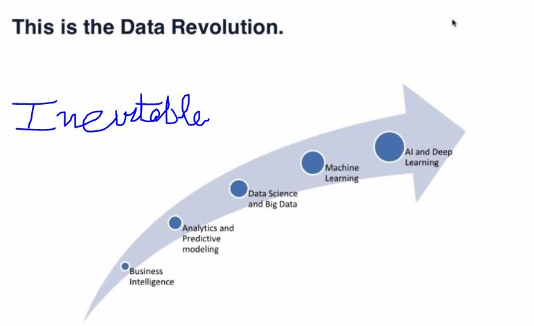

## 3 stages of AI:
>* Narrow AI
>* General AI - Adjacent work
>* Super AI - Machines much smarter than humans (Matrix Movie - **Fiction**)

## Details
>* Artificial Intelligence - The theory and development of computer systems able to perform tasks that normally require human intelligence. 
>* Machine Learning is one of the techniques to implement AI (AI can be implemented without machine learning is theoritically feasible, but practicly very difficult to create and maintain).
>* Deep Learning - is an alternative set of technique which you would deploy to increase the accuracy of machine learning models to the next levels. This mimics the behaviour of human brain.
>>* There are far more applications currently in machine learning and deep learning has just pinched in. Deep Face algorithm by Facebook using Deep Learning.
>>* Generally we use Deep Learning to enhance ML solutions.

## Growth or Evaluation
>1. Business Intelligence [] - insights.
>2. Analytics and Predictive Modeling [2012] - start predicting.
>3. Data Science and Big Data [] - .
>4. Machine Learning - [2016] - Extension of data science, you write algorithm, train models etc.
>5. AI and Deep Learning - [].

 
