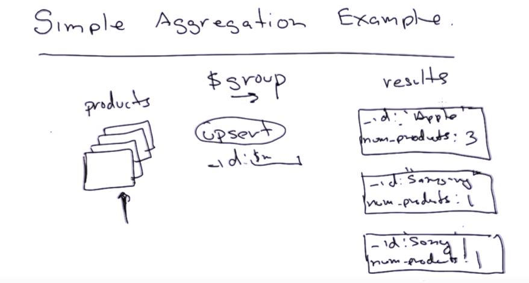

# Aggregation Framework

1. Simple Aggregation Framework
    * If I wanted to find no. of products from each manufacturer:
        * in sql we would write:
        ```sql
            select manufacturer, count(*) from products group_by manufacturer
        ```
        * in mongodb:
            ```mongo
                use agg
                
                db.products.aggregate([
                    {$group:
                        {
                            _id:"$manufacturer",
                            num_products: {$sum:1}
                        }
                    }
                ])
            ```
            
            
2. MongoDb uses **Aggregation Pipeline**:
    * Example - Collection->Project->Match->Swap->sort
    
    * Brief description of each stage in the pipeline:
        1.  ```$project``` : (reshape               - 1:!)
        2.  ```$match  ``` : (filter                - n:1) 
        3.  ```$group  ``` : (aggregate             - n:1) 
        4.  ```$sort   ``` : (sort                  - 1:1) 
        5.  ```$skip   ``` : (skip                  - n:1) 
        6.  ```$limit  ``` : (limit                 - n:1) 
        7.  ```$unwind ``` : (normalize(flatten)    - n:1) 
        8.  ```$out    ``` : (output                - n:1) 
        9.  ```$redget ``` : (authorization         ) 
        10. ```$geonear``` : (location based query  ) 
            
3. Compound Grouping
    * sql example
        ```sql
            select manufacturer, category, count(*) from products
            group_by manufacturer, category 
        ```
        
    * in mongoDB
        ```mongo
            use agg
            
            db.products.aggregate([
                {$group: 
                    {
                        _id: {
                            "manufacturer": "$manufacturer",
                            "category": "$category"
                        },
                        
                        num_products: {$sum:1} ##REPLACE_ME##
                        
                    }    
                }
            ])
        ```
        
4. _id can also be complex in mongoDB:

    ```mongo
        db.foo.insert({_id:{name: "andrew", class:"m101"}, hometown:"NY"})
    ```       
    
    
5. Aggregation (```$group```) Expressions Overview: [examples are shown below are the line (denoted by '##REPLACE_ME##') to be replaced in above example]
    * **```$sum```** - ```sum_prices: {$sum:"$price"}```
        ```mongo
            db.zips.aggregate([{"$group":{"_id":"$state", "population":{$sum:"$pop"}}}])
        ```
    * **```$avg```** - ```sum_prices: {$avg: "$price"}```
        ```mongo
            db.zips.aggregate([{"$group":{"_id":"$state", "average_pop":{$avg:"$pop"}}}])
        ```
    * **```$addtoSet```** - Add unique values in an array/set
        ```mongo
            use agg
            
            db.products.aggregate([
                {$group:
                    {
                        _id:{
                            "maker":"$manufacturer"
                        },
                        categories: {$addToSet: "$Category"}
                    }
                }
            ])
        ```
    * **```$push```** - same as $addToSet, but it can add duplicate entries 
    * **```$min```** - ```maxprice: {$max: "$price"}```
    * **```$max```** - 
    * **```$first```** - [must be used with sort] - first in each group
    * **```$last```** - [must be used with sort] - last in each group
    
    ```mongo #Largest City in each state
        db.zips.aggregate([
               {
                    $group:
                        {
                            _id: {state: "$state", city:"$city"},
                            population: {$sum:"$pop"}
                        }
               },
               {
                    $sort:
                        {
                            "_id.state":1,
                            "population":-1
                        }
               },
               {
                    $group:
                        {
                            _id: "$id.state",
                            city: {$first: "$_id.city"},
                            population: {$first: "$population"}
                        }
               }
        ])
    ```
    
    **NOTE**: We can do **DOUBLE GROUPING**. Eg - avg of every students' avg marks
        ```mongo
            use agg
            
            db.grades.aggregate([
                {
                    '$group': 
                        {
                            _id: {class_id:"$class_id", student_id:"$student_id"},
                            'average': {"$avg":"$score"}
                        }
                },
                {
                    '$group': 
                        {
                            _id: "$_id.class_id",
                            'average': {"$avg":"$average"}
                        }
                },
            ])
        ```
        
        **Sample Question**
        ```mongo
            > db.fun.find()
                { "_id" : 0, "a" : 0, "b" : 0, "c" : 21 }
                { "_id" : 1, "a" : 0, "b" : 0, "c" : 54 }
                { "_id" : 2, "a" : 0, "b" : 1, "c" : 52 }
                { "_id" : 3, "a" : 0, "b" : 1, "c" : 17 }
                { "_id" : 4, "a" : 1, "b" : 0, "c" : 22 }
                { "_id" : 5, "a" : 1, "b" : 0, "c" : 5 }
                { "_id" : 6, "a" : 1, "b" : 1, "c" : 87 }
                { "_id" : 7, "a" : 1, "b" : 1, "c" : 97 }
                
            db.fun.aggregate([{$group:{_id:{a:"$a", b:"$b"}, c:{$max:"$c"}}}, {$group:{_id:"$_id.a", c:{$min:"$c"}}}])
            
            Answer - 52, 22
        ```
    
6.  ```$project PHASE```
    * Can do following:
        1. remove keys
        2. add new keys
        3. reshape keys - put a key in some document
        4. Use some simple functions on keys
            * ```$toUpper```
            * ```$toLower```
            * ```$add```
            * ```$multiply```
            
    * Example:
        ```mongo
            use agg
            
            db.products.aggregate([
              {
                $project:
                  {
                    _id:0, # remove key
                    'maker': {$toLower: '$manufacturer'}, # add new key
                    'details': {
                                  'category':'$category', # reshape
                                  'price': {"$multiply": ["$price", 10]} # simple function
                               },
                    'item': "$name "
                  }
              }
            ])
        ```
        
        ```mongo
             INPUT:
                    {
                        "city" : "ACMAR",
                        "loc" : [
                            -86.51557,
                            33.584132
                        ],
                        "pop" : 6055,
                        "state" : "AL",
                        "_id" : "35004"
                    }      
              
             EXPECTED OUTPUT:
                   {
                        "city" : "acmar",
                        "pop" : 6055,
                        "state" : "AL",
                        "zip" : "35004"
                    } 
              
             QUERY: 
             db.zips.aggregate([{$project:{_id:0, city:{$toLower:"$city"}, pop:1, state:1, zip:"$_id"}}])
        ```
        
        
7. ```$match PHASE:```
    * used to filter ( and then do aggregation or even before it)
    ```mongo
        use agg
        
        db.zips.aggregate([
            {
                $match:
                    {
                        state: 'CA'
                    }
            },
            {
                $group:
                    {
                        _id: "$city",
                        population: {$sum: "$pop"},
                        zip_codes: {$addToSet: "$_id"}
                    }
            },
            {
                $project:  #don't maintain the given order in output
                    {
                        _id: 0,
                        city:"$_id",
                        population: 1,
                        zip_codes: 1
                    }
            }
        ])
    ```
    
8. ```$text PHASE:```
    * For full text search (advanced version of match, **Must be used with $match and that too as first stage**)
    
    ```mongo
        use sample
        
        db.sentences.aggregate([
            {
                $match:
                    {
                        $text: {$search: 'tree rat'}
                    }
            },
            {
                $sort:
                    {
                        $meta: "textScore"
                    }
            },
            {
                $project:
                    {
                        words: 1,
                        _id:0
                    }
            }
        ])
    ```
    
 9. ```$sort PHASE:```
    * MongoDB have both options of disk and memory based sort (default with 100 MB)
    * can do before or after the grouping (preferred to use both at the same time)
    ```mongo
        use agg
        
        db.zips.aggregate([
            {
                $match:
                    {
                        state: 'CA'
                    }
            },
            {
                $group:
                    {
                        _id: "$city",
                        population: {$sum: "$pop"},
                        zip_codes: {$addToSet: "$_id"}
                    }
            },
            {
                $project:  #don't maintain the given order in output
                    {
                        _id: 0,
                        city:"$_id",
                        population: 1,
                        zip_codes: 1
                    }
            },
            {
                $sort:
                    {
                        population: -1
                    }
            }
        ])
    ```
    
    ```mongo
        db.zips.aggregate([{$sort:{state:1, city:1}}])
    ```


 10. ```$sort (mandatory) --> $skip (optional) --> $limit (optional) PHASE:```
    
    ```mongo
        use agg
        
        db.zips.aggregate([
            {
                $match:
                    {
                        state: 'CA'
                    }
            },
            {
                $group:
                    {
                        _id: "$city",
                        population: {$sum: "$pop"},
                        zip_codes: {$addToSet: "$_id"}
                    }
            },
            {
                $project:  #don't maintain the given order in output
                    {
                        _id: 0,
                        city:"$_id",
                        population: 1,
                        zip_codes: 1
                    }
            },
            {
                $sort:
                    {
                        population: -1
                    }
            },
            {$skip:10},
            {$limit:5}
        ])
    ```
    * if we use limit before the skip then like below, then it will return 0 entries 
        ```{$limit: 5},{$skip: 10}```
        
11. ```$unwind PHASE:``` **DOUBLE UNWIND is also possible**
       ```mongo
           {a:'1',b:'2',c:['Apple','Orange','Banana']}
       
            $unwind: "$c" will results into following:
            
            {a:'1',b:'2',c:'Apple'}
            {a:'1',b:'2',c:'Orange'}
            {a:'1',b:'2',c:'Banana'}
       ```
       
       
12. ```$out PHASE``` - Added in MongoDB 2.6
    * Send output of a query to another collection
    ```mongo
        db.games.aggregate([
            {
                $group:
                    {
                        _id:{
                                first_name: "$first_name",
                                last_name: "$last_name"
                            },
                        points: {$sum: "$points"}
                    }
            },
            {$out: 'summary_results'} #summary_results not present or if present then overwrite (but there is some error in between then it preserves previous one as it maintains a temperary collection)
        ])
    ```

13. Aggregation Options
    1. explain - query plan
    2. allowDiskUse - limit 100 MB (sort exception is project)
    3. cursor - 
    
    ```mongo
        db.zips.aggregate(
                            [
                                {
                                    $group: {
                                        _id:"$state",
                                        population: {$sum:"$pop"}
                                    }
                                }
                            ],
                            {explain: true}
        )
    ```
    
    ```javascript 1.8
        db.zips.aggregate(
                            [
                                {
                                    $group: {
                                        _id:"$state",
                                        population: {$sum:"$pop"}
                                    }
                                }
                            ],
                            {allowDiskUse: true}
        )
    ```
    
    **NOTE**: There are two options of giving stages in mongoDB:
        1. aggregate([stage,stage,stage,stage]) # **Aggregation options are supported in this form only**
        2. aggregate(stage,stage,stage,stage)
        
        
14. Python & Aggregation:
    * Aggregation after 2.6 returns a cursor in shell
    * But in python, we still get a big document (by default)
    
    ```python
            import pymongo
            
            connection = pymong.MongoClient()
            db = connection.agg
            
            result = db.zips.aggregate([{"$group": {"_id":"$state", "population":{"$sum":"$pop"}}}])
            # result_cursor = db.zips.aggregate([{"$group": {"_id":"$state", "population":{"$sum":"$pop"}}}], cursor={}, allowDiskUse=True)
            # for tt in result_cursor:
            #     print(tt)
            
            print(result)
    ```
    
15. Check **SQL to Aggregation Framework Mapping Chart**

16. Limitations in Aggregation:
    1. 100 MB limit for pipeline stages - Solution use allowDiskUse
    2. 16 MB limit by default in python - Solution use cursor={}
    3. sharded - group by, sort - Apache Hadoop (Map-Reduce)
        * Sharded system have multiple shards
        * For grouping and sort methods etc got applied then we need one machine where it get's collated.
        
 