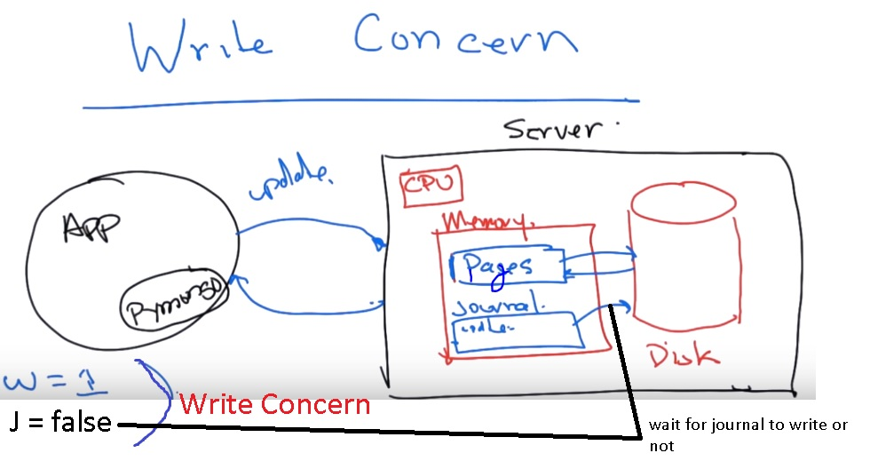
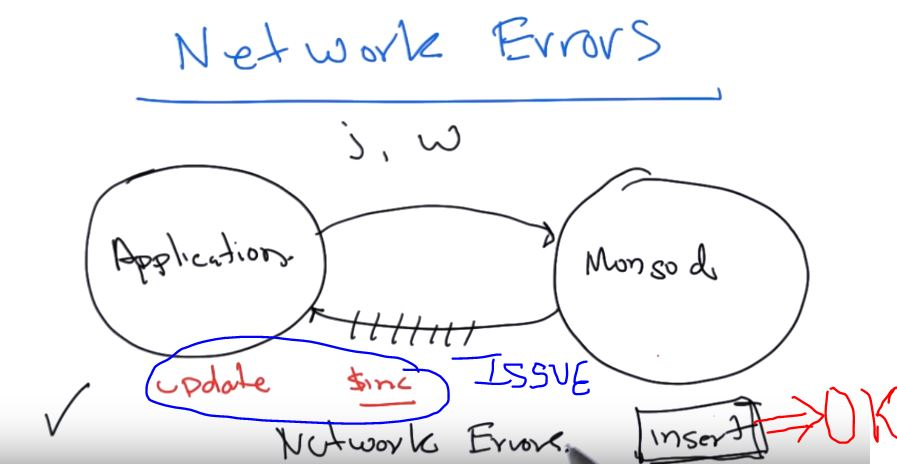
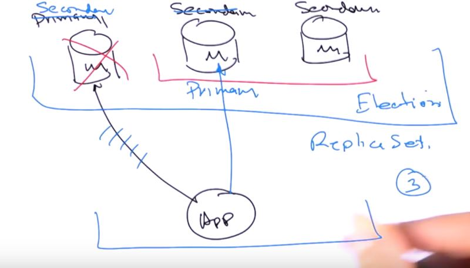
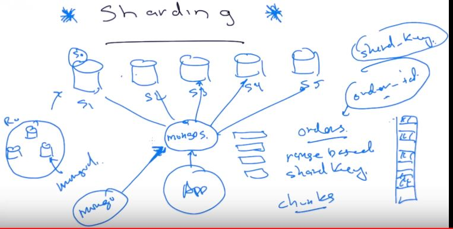
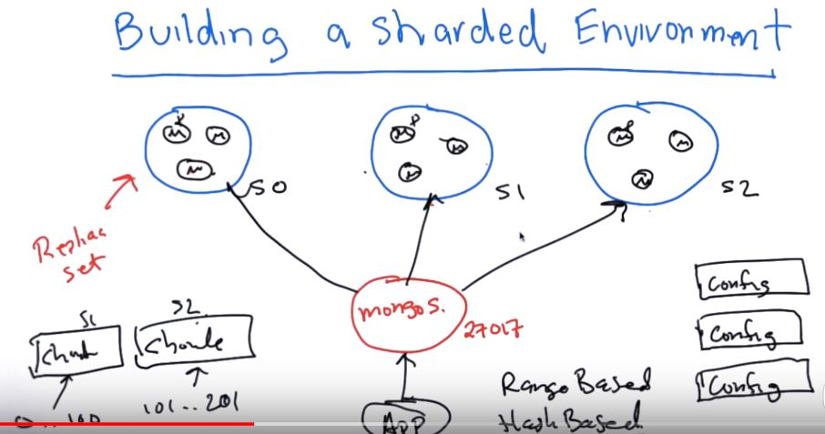

# Topics to be covered
>* Durabiliy of writes (how you know that data is persist on disk)
>* Replication of data (for availability), 
>* Sharding (distribute data across multiple servers)

## Write Concern
>* There are two parameters which we should be aware about:
>>* w (=1 by default) -> Time taken by memory to reply the application
>>* j (=false or 0 by default) -> should the application wait for journel to write on the disk.



>* Combination of different values of w & j:

|W|j|Comments|
|-|-|--------|
|1|false|**default**<br>fast<br>small window of vulnarability|
|1|true|slow<br>greater level of safety|
|0|not acknowledge||


## Network Error
>* Some times due to network error, we might not get the acknowledgement whether our command has executed or not:
>* In this case, there could be two possibilities:
>>* While sending the msg, it got some network issue --> **NO CHANGE TO DB**
>>* Acknowledgement from the server never reached to the application --> **DB UPDATED** (may be - unless special scenarios happended like constraint exception comes it etc.)



>* Issues with the command:
>>* Now we can use the same insert query multiple times if it has same id --> **GOOD**
>>* Updates will cause the issue especially for those whose with non-idempotent operators like **inc** --> **BAD**


## Introduction to Replication:
>>* Availability
>>* Fault Tolerance

>>* Minimum number of nodes is 3 (to support the architecture) -> Can be increased
>>* It starts with 1 primary and 2 secondary.
>>* When primary goes down, an election happens between 2 secondary to become one primary nodes between them.
>>* If after some time old primary nodes comes up back, then it join the **replica set** as secondary node only



## Replica Set Elections:
>* Types of replica set nodes:
>>* Regular - normal type of node can be primary or secondary
>>* Arbiter - only for voting purposes (even no. of secondary nodes)
>>* Delayed/Regular - disaster coming nodes (2 hrs behind other nodes), can't become a primary node
>>* Hidden - used for analytics (priority is 0, so can't become primary)


## Write Consistency:
>* As per architecture, there would be only one primary node at any point of time, so application will communicate with primary nodes only.
>* We can do configuration that application can also start reading or writing to secondary nodes. --> advantage - read scaling, disadvantage - stale read


## Creating a Replica Set: [Obsolete now]
>* Creating replica set - 1 primary + 2 secondary

```text
#!/usr/bin/env bash

mkdir -p /data/rs1 /data/rs2 /data/rs3
mongod --replSet m101 --logpath "1.log" --dbpath /data/rs1 --port 27017 --oplogSize 64 --fork --smallfiles
mongod --replSet m101 --logpath "2.log" --dbpath /data/rs2 --port 27018 --oplogSize 64 --smallfiles --fork
mongod --replSet m101 --logpath "3.log" --dbpath /data/rs3 --port 27019 --oplogSize 64 --smallfiles --fork
```

>* init configuration command
 
```javascript 1.8
config = { _id: "m101", members:[
          { _id : 0, host : "localhost:27017"},
          { _id : 1, host : "localhost:27018"},
          { _id : 2, host : "localhost:27019"} ]
};

rs.initiate(config);
rs.status();
```

>* Few commands:
>>* rs.status()
>>* rs.help()
>>* rs.slaveOk() - allow read from secondary node
>* We can't write to secondary


## Replica Set Internals: 
>* Secondaries are constantly reading the oplog of the primary. It's true that the oplog entries originally come from the primary, but secondaries can sync from another secondary, as long as at least there is a chain of oplog syncs that lead back to the primary.
>* Example of 3 node replica sets:
>>* Each node has oplog, which also has optime who shows when last it got refreshed for secondary nodes
>>* If oplog rolled in primary, then it would be difficult for secondary to start with the last point while refreshing. So it need to trace the complete database for the same.

```text
use local
show collections
oplog.rs -> will be the ouptput

db.oplog.rs.find() # to check the oplogs 
```

## Failover and Rollback: 
>* There might be some lag between writing to primary and taking it's backup on secondary.
>>* So there are good changes that secondary nodes doesn't have the most updated values and one of these would finally become primary.
>>* Now old primary may come back again and acts as secondary this time.
>>* This new secondary (old primary) would have that missed data so it will rollback that data and put this in a separate file (which can be manually applied)
>* Solution to above problem:
>>* We can wait at the application level code till some of the secondary nodes have the same changes. (w=1, j=1 etc configuration discussed earlier)


## Connecting to a replica set from pymongo:
>* Mongo Client pymongo comes with most of the complexity to deal with replica set (that's the beauty here)
>* If you leave a replica set node out of the seedlist within the driver, what will happen?
>>* The missing node will be discovered as long as you list at least one valid node.

```python
import pymongo
import sys

c = pymongo.MongoClient(host=["mongodb://localhost:27017",
                              "mongodb://localhost:27018",
                              "mongodb://localhost:27019"],
                               replicaSet="m101",
                              w=1,
                              j=True)

db = c.m101
people = db.people

try:
    print("inserting")
    people.insert_one({"name":"Andrew Erlichson", "favorite_color":"blue"})
    print("inserting")
    people.insert_one({"name":"Richard Krueter", "favorite_color":"red"})
    print("inserting")
    people.insert_one({"name":"Dwight Merriman", "favorite_color":"green"})
except Exception as e:
    print("Unexpected error:", type(e), e)
print("completed the inserts")
```

## What happens when failover occurs:
>* Suppose primary got down and election doesn't completed for some time and few writes and reads come in.
>>* By default, if we don't do anything in pymongo, this will close the connection even if we have connected via replica set in pymongo.
>* What will happen if the following statement is executed in Python during a primary election?
>>>* db.test.insert_one({'x':1})
>>* Insert will fail, program will terminate


## Detecting Failovers:
>* Run a long program and in between bring the primary down manually
>>* rs.status()
>>* connect the primary from console
>>* run the python program
>>* rs.stepDown() # from the console of primary (which we opened)
>* One solution to this is eat that exception, but it doesn't seems to be practicle.

```python
import pymongo
import sys
import time

c = pymongo.MongoClient(host=["mongodb://localhost:27017",
                              "mongodb://localhost:27018",
                              "mongodb://localhost:27019"],
                        replicaSet="m101")

db = c.m101

things = db.things
things.delete_many({})   # remove all the docs in the collection

for i in range(0,500):
    try:
        things.insert_one({'_id':i})
        print("Inserted Document: " + str(i))
        time.sleep(.1)
    except Exception as e:
        print("Exception ",type(e), e)
```

 ## Proper handling of Failovers for Inserts:
>* Retries could be a good solution

```python

import pymongo
import sys
import time

c = pymongo.MongoClient(host=["mongodb://localhost:27017",
                              "mongodb://localhost:27018",
                              "mongodb://localhost:27019"],
                        replicaSet="m101")

db = c.m101

things = db.things
things.delete_many({})   # remove all the docs in the collection


for i in range(0,500):
    for retry in range (3):
        try:
            things.insert_one({'_id':i})
            print("Inserted Document: " + str(i))
            time.sleep(.1)
            break
        except pymongo.errors.AutoReconnect as e:
            print("Exception ",type(e), e)
            print("Retrying..")
            time.sleep(5)
        except pymongo.errors.DuplicateKeyError as e:
            print("duplicate..but it worked") # may be because it got written but didn't acknowledged due to network issue
            break
```


## Proper handling of Failovers for Reads:
>* Same as in insert, but here we don't need DuplicateKeyError here.

## Proper handling of Failovers for Updates:
>* Retries will not work for every scenario here especially for operators like $inc, $push which are not idempotent. (unlike $set)
>>* Now in this case say suppose primary successfully done the changes but because of network issue application didn't get the acknowledgement of the same and if it will retry the same on secondary nodes then it will corrupt the data.
>* Better solution:
>>* Before retry check the database if it's updated or not.
>>* Change a non-idempotent update to the idempotent update so that we can retry the same without the issue. 
>>>* Good solution but if the application is multithreaded (practically preferred)- we might have synchronization solutions.

```python
#!/usr/bin/env python
"""
Updates documents in a safe manner and catches expected errors.
"""

import pymongo
import time


# Previous code; left here for reference.
# for i in range(0,500):
#     for retry in range (3):
#         try:
#             things.update_one({'_id':i}, {'$inc':{'votes':1}})
my_line
#             time.sleep(.1)
#             break
#         except pymongo.errors.AutoReconnect as e:
#             print "Exception ",type(e), e
#             print "Retrying.."
#             time.sleep(5)


def main():
    client = pymongo.MongoClient(host=["mongodb://localhost:27017",
                                       "mongodb://localhost:27018",
                                       "mongodb://localhost:27019"],
                                 replicaSet="m101")

    db = client.m101
    things = db.things

    for i in range(500):
        time.sleep(.1)  # Don't want this to go too fast.
        for retry in range(3):
            try:  # to read the doc up to 3 times.
                votes = things.find_one({'_id': i})["votes"] + 1
                break
            except pymongo.errors.AutoReconnect as e:  # failover!
                print ("Exception reading doc with _id = {_id}. " +
                       "{te}: {e}").format(_id=i, te=type(e), e=e)
                print("Retrying...")
                time.sleep(5)
        else: 
            print("Unable to read from the database. Aborting.")
            exit()
        for retry in range(3):
            try:  # to read the doc up to 3 times.
                things.update_one({'_id': i}, {'$set': {'votes': votes}})
                print("Updated Document with _id = {_id}".format(_id=i))
                break
            except pymongo.errors.AutoReconnect as e:  # failover!
                print(("Exception writing doc with _id = {_id}. " +
                       "{te}: {e}").format(_id=i, te=type(e), e=e))
                print("Retrying...")
                time.sleep(5)
        else:  # If no break, we failed to write the document. Abort.
            print(("We have failed to increment the 'votes' field for " +
                   "the document with _id = {_id} to {votes}. Exiting.")
                  ).format(_id=i, votes=votes)
            exit()


if __name__ == '__main__':
    main()
```

## Write Concern Revisited:
>* for 3 nodes:
>>* w=1 -> wait for primary to acknowledge the write
>>* w=2 -> wait for primary & any one secondary to acknowledge the write
>>* w=3 -> wait for all 3 nodes to acknowledge the write
>>* wtimeout -> how long you wait can also be set in the driver.
>* These values can be set at 3 levels:
>>* Connection 
>>* Collections
>>* Replica Set - preferred
>* journel only exists in primary node

```python

import pymongo

read_pref = pymongo.read_preferences.ReadPreference.SECONDARY

c = pymongo.MongoClient(host="mongodb://localhost:27017",
                        replicaSet="rs1",
                        w=3, wtimeout=10000, j=True, 
                        read_preference=read_pref)

db = c.m101
people = db.people

print("inserting")
people.insert({"name":"Andrew Erlichson", "favorite_color":"blue"})
print("inserting")
people.insert({"name":"Richard Krueter", "favorite_color":"red"})
print("inserting")
people.insert({"name":"Dwight Merriman", "favorite_color":"green"})
```

## Read Preferences:
>* By default, read and write is only possible in primary node
>* Following options:
>>* Primary -> default, read only from primary
>>* Secondary -> This would be evatual consistense read (might not have the most latest updated data in secondary)
>>* SecondaryPreferred -> 
>>* Nearest ->
>* If you want to read from secondary,

>* You can configure your applications via the drivers to read from secondary nodes within a replica set. What are the reasons that you might not want to do that? Check all that apply.
>>* If your write traffic is great enough, and your secondary is less powerful than the primary, you may overwhelm the secondary, which must process all the writes as well as the reads. Replication lag can result.
>>* You may not read what you previously wrote to MongoDB on a secondary because it will lag behind by some amount.
>>* If the secondary hardware has insufficient memory to keep the read working set in memory, directing reads to it will likely slow it down.

```text
In some ways, this question goes a bit beyond the lecture. It discusses what can go wrong, particularly for a non-recommended deployment. That said, this list of answers includes things that people do try to implement from time to time, so we want to make sure you're aware of the dangers.

Answers:

Reading from a secondary prevents it from being promoted to primary.
False.
Reading from a secondary does not directly affect a secondary's ability to become primary, though if the reads caused it to lag on writes and fall behind on the oplog, that might make it ineligible until it is able to catch up. Here's a note on replication lag.
If the secondary hardware has insufficient memory to keep the read working set in memory, directing reads to it will likely slow it down.
True.
This could really go either way. If the secondary has excess capacity, beyond what it needs to take writes, then directing reads to it would cause it to work more, but perhaps it would still be able to keep up with the oplog. On the other hand, if the primary is taking writes faster than the secondary can keep up, then this scenario would definitely slow it down.
Generally, your secondary should be on the same hardware as your primary, so if that's the case, and your primary would be able to keep up with the reads, then this shouldn't be a problem. Of course, if your primary can handle both the read and write loads, then there's really no compelling reason to send the reads to the secondary.
If your write traffic is great enough, and your secondary is less powerful than the primary, you may overwhelm the secondary, which must process all the writes as well as the reads. Replication lag can result.
True.
This is a design anti-pattern that we sometimes see.
A similar anti-pattern occurs when reads are routed to the primary, but the secondary is underpowered and unable to handle the full read + write load. In this case, if the secondary becomes primary, it will be unable to fulfill its job.
You may not read what you previously wrote to MongoDB on a secondary because it will lag behind by some amount.
True.
This is pretty straightforward. Unless you are reading from the primary, the secondary will not necessarily have the most current version of the documents you need to read.
Whether this is a problem or not depends on your application's requirements and business concerns, so it goes a bit outside the scope of development.
```

## Review of implication of replication:
>* Advantages of replica set is that they are very transparent for developers to use
>* Few things to consider:
>>* Seed lists -> Driver need to know atleast one member of the replica set
>>* Write Concern -> Need to keep in mind what are the significance of w,j,wtimeout etc parameters
>>* Read Preferences -> 
>>* Errors can happen -> Still errors can always occur


## Sharing:
>* Horizontal Scaling options.
>* Rather than putting a collection in one database, we put a collection across different nodes, called as shards.
>* If there are 4 shards and no shared key is stored for a query then it will send query to all 4 shards (which eventually will send query to its replica set where only one node (primary) will execute the query)


## Building a Sharing Environment
>* Two types of config:
>>* Range-Based - (0-200 belong to Shard-1)
>>* Hash-Based - (hash abc means Shard-1)


```text
Example in bat


REM  Andrew Erlichson - Original author
REM  Jai Hirsch       - Translated original .sh file to .bat
REM  Nathan Leniz     - Updated for MongoDB 3.4
REM  10gen
REM  script to start a sharded environment on localhost

echo "del data files for a clean start"

del /Q c:\data\shard0
del /Q c:\data\shard1
del /Q c:\data\shard2
del /Q c:\data\config

mongo -eval "sleep(5000)" --nodb

REM  start a replica set and tell it that it will be a shard0

mkdir c:\data\shard0\rs0
mkdir c:\data\shard0\rs1
mkdir c:\data\shard0\rs2
start mongod --replSet s0 --dbpath c:\data\shard0\rs0 --port 37017  --shardsvr --oplogSize 100
start mongod --replSet s0 --dbpath c:\data\shard0\rs1 --port 37018  --shardsvr --oplogSize 100
start mongod --replSet s0 --dbpath c:\data\shard0\rs2 --port 37019  --shardsvr --oplogSize 100

mongo --eval "sleep(5000)" --nodb

REM  connect to one server and initiate the set
mongo --port 37017 --eval "config = { _id: 's0', members:[{ _id : 0, host : 'localhost:37017' },{ _id : 1, host : 'localhost:37018' },{ _id : 2, host : 'localhost:37019' }]};rs.initiate(config)"

REM  start a replicate set and tell it that it will be a shard1
mkdir c:\data\shard1\rs0
mkdir c:\data\shard1\rs1
mkdir c:\data\shard1\rs2

start mongod --replSet s1 --dbpath c:\data\shard1\rs0 --port 47017  --shardsvr --oplogSize 100
start mongod --replSet s1 --dbpath c:\data\shard1\rs1 --port 47018  --shardsvr --oplogSize 100
start mongod --replSet s1 --dbpath c:\data\shard1\rs2 --port 47019  --shardsvr --oplogSize 100

mongo --eval "sleep(5000)" --nodb

mongo --port 47017 --eval "config = { _id: 's1', members:[{ _id : 0, host : 'localhost:47017' },{ _id : 1, host : 'localhost:47018' },{ _id : 2, host : 'localhost:47019' }]};rs.initiate(config);"

REM  start a replicate set and tell it that it will be a shard2
mkdir c:\data\shard2\rs0
mkdir c:\data\shard2\rs1
mkdir c:\data\shard2\rs2
start mongod --replSet s2 --dbpath c:\data\shard2\rs0 --port 57017  --shardsvr --oplogSize 100
start mongod --replSet s2 --dbpath c:\data\shard2\rs1 --port 57018  --shardsvr --oplogSize 100
start mongod --replSet s2 --dbpath c:\data\shard2\rs2 --port 57019  --shardsvr --oplogSize 100

mongo --eval "sleep(5000)" --nodb

mongo --port 57017 --eval "config = { _id: 's2', members:[{ _id : 0, host : 'localhost:57017' },{ _id : 1, host : 'localhost:57018' },{ _id : 2, host : 'localhost:57019' }]};rs.initiate(config)"

REM  now start 3 config servers

mkdir c:\data\config\config-a
mkdir c:\data\config\config-b
mkdir c:\data\config\config-c
start mongod --replSet csReplSet --dbpath c:\data\config\config-a --port 57040 --configsvr --oplogSize 100
start mongod --replSet csReplSet --dbpath c:\data\config\config-b --port 57041 --configsvr --oplogSize 100
start mongod --replSet csReplSet --dbpath c:\data\config\config-c --port 57042 --configsvr --oplogSize 100

mongo --eval "sleep(5000)" --nodb

mongo --port 57040 --eval "config = { _id: 'csReplSet', members:[{ _id : 0, host : 'localhost:57040' },{ _id : 1, host : 'localhost:57041' },{ _id : 2, host : 'localhost:57042' }]};rs.initiate(config)"

echo "now start the mongos on a standard port"
start mongos  --configdb csReplSet/localhost:57040,localhost:57041,localhost:57042

echo "Wait 30 seconds for the replica sets to fully come online"
mongo --eval "sleep(30000)" --nodb

echo "Connnecting to mongos and enabling sharding"

REM  add shards and enable sharding on the test db
mongo --eval "db=db.getSisterDB('admin');db.runCommand( { addshard : 's0/'+'localhost:37017' } );db.runCommand( { addshard : 's1/'+'localhost:47017' } );db.runCommand( { addshard : 's2/'+'localhost:57017' } )"
mongo --eval "db=db.getSisterDB('admin');db.runCommand({enableSharding: 'school'});db.runCommand({shardCollection: 'school.students', key: {student_id:1}})"

```

```text
Shell Example


# Andrew Erlichson
# Nathan Leniz - modified to update for MongoDB 3.4
# MongoDB
# script to start a sharded environment on localhost

# clean everything up
echo "killing mongod and mongos"
killall mongod
killall mongos
echo "removing data files"
rm -rf /data/config
rm -rf /data/shard*


# start a replica set and tell it that it will be shard0
echo "starting servers for shard 0"
mkdir -p /data/shard0/rs0 /data/shard0/rs1 /data/shard0/rs2
mongod --replSet s0 --logpath "s0-r0.log" --dbpath /data/shard0/rs0 --port 37017 --fork --shardsvr
mongod --replSet s0 --logpath "s0-r1.log" --dbpath /data/shard0/rs1 --port 37018 --fork --shardsvr
mongod --replSet s0 --logpath "s0-r2.log" --dbpath /data/shard0/rs2 --port 37019 --fork --shardsvr

sleep 5
# connect to one server and initiate the set
echo "Configuring s0 replica set"
mongo --port 37017 << 'EOF'
config = { _id: "s0", members:[
          { _id : 0, host : "localhost:37017" },
          { _id : 1, host : "localhost:37018" },
          { _id : 2, host : "localhost:37019" }]};
rs.initiate(config)
EOF

# start a replicate set and tell it that it will be a shard1
echo "starting servers for shard 1"
mkdir -p /data/shard1/rs0 /data/shard1/rs1 /data/shard1/rs2
mongod --replSet s1 --logpath "s1-r0.log" --dbpath /data/shard1/rs0 --port 47017 --fork --shardsvr
mongod --replSet s1 --logpath "s1-r1.log" --dbpath /data/shard1/rs1 --port 47018 --fork --shardsvr
mongod --replSet s1 --logpath "s1-r2.log" --dbpath /data/shard1/rs2 --port 47019 --fork --shardsvr

sleep 5

echo "Configuring s1 replica set"
mongo --port 47017 << 'EOF'
config = { _id: "s1", members:[
          { _id : 0, host : "localhost:47017" },
          { _id : 1, host : "localhost:47018" },
          { _id : 2, host : "localhost:47019" }]};
rs.initiate(config)
EOF

# start a replicate set and tell it that it will be a shard2
echo "starting servers for shard 2"
mkdir -p /data/shard2/rs0 /data/shard2/rs1 /data/shard2/rs2
mongod --replSet s2 --logpath "s2-r0.log" --dbpath /data/shard2/rs0 --port 57017 --fork --shardsvr
mongod --replSet s2 --logpath "s2-r1.log" --dbpath /data/shard2/rs1 --port 57018 --fork --shardsvr
mongod --replSet s2 --logpath "s2-r2.log" --dbpath /data/shard2/rs2 --port 57019 --fork --shardsvr

sleep 5

echo "Configuring s2 replica set"
mongo --port 57017 << 'EOF'
config = { _id: "s2", members:[
          { _id : 0, host : "localhost:57017" },
          { _id : 1, host : "localhost:57018" },
          { _id : 2, host : "localhost:57019" }]};
rs.initiate(config)
EOF


# now start 3 config servers
echo "Starting config servers"
mkdir -p /data/config/config-a /data/config/config-b /data/config/config-c
mongod --replSet csReplSet --logpath "cfg-a.log" --dbpath /data/config/config-a --port 57040 --fork --configsvr
mongod --replSet csReplSet --logpath "cfg-b.log" --dbpath /data/config/config-b --port 57041 --fork --configsvr
mongod --replSet csReplSet --logpath "cfg-c.log" --dbpath /data/config/config-c --port 57042 --fork --configsvr

echo "Configuring configuration server replica set"
mongo --port 57040 << 'EOF'
config = { _id: "csReplSet", members:[
          { _id : 0, host : "localhost:57040" },
          { _id : 1, host : "localhost:57041" },
          { _id : 2, host : "localhost:57042" }]};
rs.initiate(config)
EOF

# now start the mongos on a standard port
mongos --logpath "mongos-1.log" --configdb csReplSet/localhost:57040,localhost:57041,localhost:57042 --fork
echo "Waiting 60 seconds for the replica sets to fully come online"
sleep 60
echo "Connnecting to mongos and enabling sharding"

# add shards and enable sharding on the test db
mongo <<'EOF'
use admin
db.runCommand( { addshard : "s0/localhost:37017" } );
db.runCommand( { addshard : "s1/localhost:47017" } );
db.runCommand( { addshard : "s2/localhost:57017" } );
db.runCommand( { enableSharding: "school" } );
db.runCommand( { shardCollection: "school.students", key: { student_id:1 } } );
EOF
```

```javascript 1.8
db=db.getSiblingDB("school");
types = ['exam', 'quiz', 'homework', 'homework'];
// 10,000 students
for (i = 0; i < 10000; i++) {

    // take 10 classes
    for (class_counter = 0; class_counter < 10; class_counter ++) {
	scores = []
	    // and each class has 4 grades
	    for (j = 0; j < 4; j++) {
		scores.push({'type':types[j],'score':Math.random()*100});
	    }

	// there are 500 different classes that they can take
	class_id = Math.floor(Math.random()*501); // get a class id between 0 and 500

	record = {'student_id':i, 'scores':scores, 'class_id':class_id};
	db.students.insert(record);

    }

}
```


## Implications of Sharding
>* Every document needs to include shard key
>* Shard key is immutable
>* Need an index that starts with shard-key
>* Shard key specified multi-key
>* No Shard Key -> scatter gather operation (sending msg to all shards) 
>* Can't have a unique index unless part of shard key
>>* Suppose you wanted to shard the zip code collection after importing it. You want to shard on zip code. What index would be required to allow MongoDB to shard on zip code?
>>>* An index on zip or a non-multi-key index that starts with zip.


## Sharding and Replication
>* Always done together
>>* Shards themselves are replica sets
>* Suppose you want to run multiple mongos routers for redundancy. What level of the stack will assure that you can failover to a different mongos from within your application?
>>* drivers

## Choosing a Shared Key:
>* It is important because it impacts performance
>1. First thing you need to consider that there is enough cardinality - that means sufficient number of possible values for shared key must exists
>>* For example if there are just 3 possible options to select shard key, then we can't distribute the data across 100 shards
>2. Hotspotting monotonically increasing
>>*  