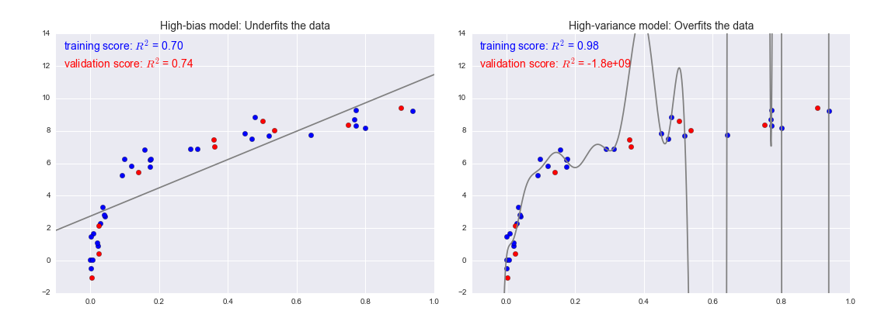
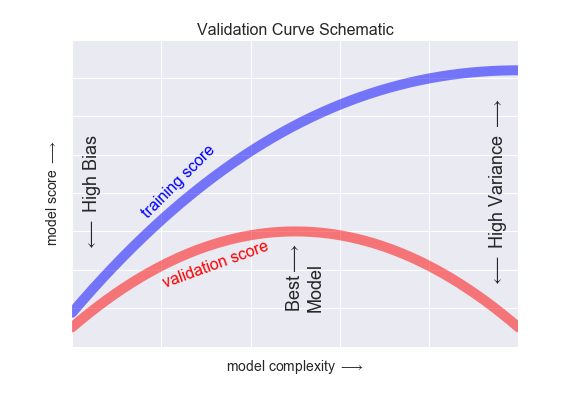
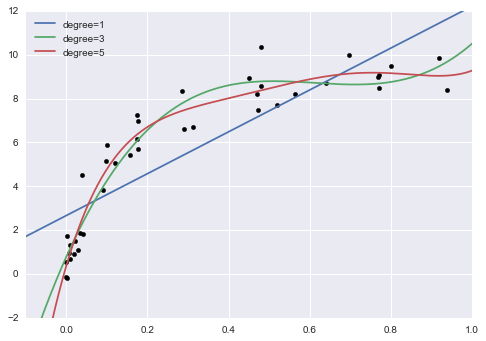
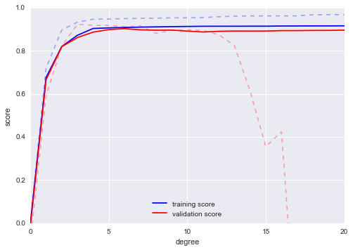
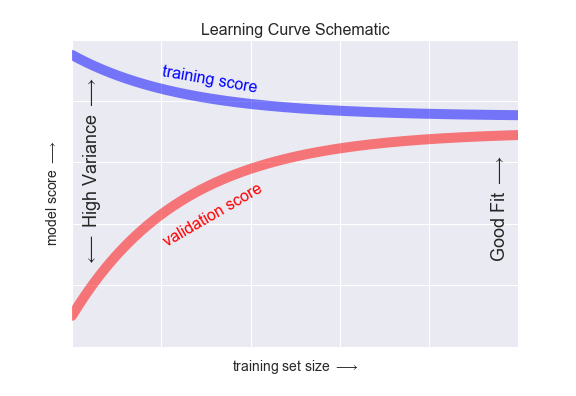
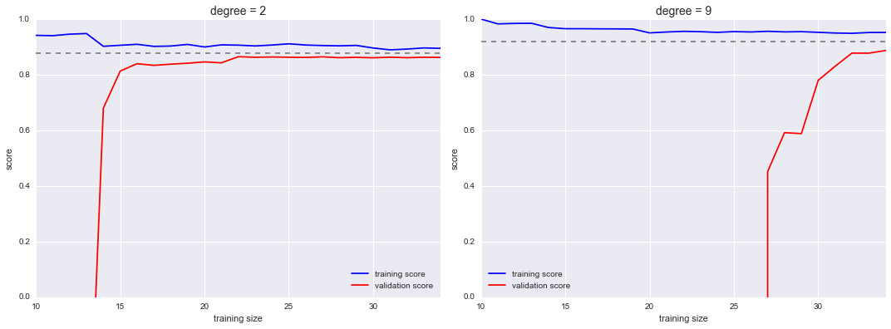
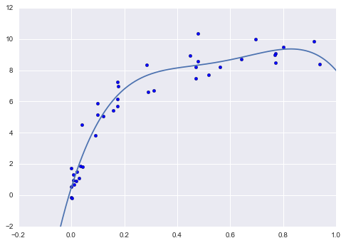

# Selecting Best Model
## If our estimator is underperforming, how should we move forward?
> 1. The Bias-variance trade-off
>>* The question of "the best model" is about finding a sweet spot in the tradeoff between bias and variance.

>>* Both above will fail:
>>>* **Left Graph**: Data are intrinsically more complicated than a straight line. **UNDER-FIT** - not enough model flexibility - **HIGH BIAS**.
>>>* **Right Graph**: Attempts to fit a high-order polynomial through the data. **OVERFIT** - much model flexibility - **HIGH VARIANCE**.
>>>* R-square (coefficient of determination): measures how well a model performs relative to a simple mean of the target values.
>>>>* r-square = 1 => perfect match
>>>>* r-square = 0 => no better than simply taking the mean 
>>>>* r-square = -ve => even worse then mean
>>>>>* For high-bias models, the performance of the model on the validation set is similar to the performance on the training set.
>>>>>* For high-variance models, the performance of the model on the validation set is far worse than the performance on the training set.

> 2. Validation curves in Scikit-Learn
>>* Here we will use a polynomial regression model: this is a generalized linear model in which the degree of the polynomial is a tunable parameter.
>>* In Scikit-Learn, we can implement this with a simple linear regression combined with the polynomial preprocessor. We will use a pipeline to string these operations together.
```python
from sklearn.preprocessing import PolynomialFeatures
from sklearn.linear_model import LinearRegression
from sklearn.pipeline import make_pipeline

def PolynomialRegression(degree=2, **kwargs):
    return make_pipeline(PolynomialFeatures(degree),
                         LinearRegression(**kwargs))
                         
                         
import numpy as np

def make_data(N, err=1.0, rseed=1):
    # randomly sample the data
    rng = np.random.RandomState(rseed)
    X = rng.rand(N, 1) ** 2
    y = 10 - 1. / (X.ravel() + 0.1)
    if err > 0:
        y += err * rng.randn(N)
    return X, y

X, y = make_data(40)


import matplotlib.pyplot as plt
import seaborn; seaborn.set()  # plot formatting

X_test = np.linspace(-0.1, 1.1, 500)[:, None]

plt.scatter(X.ravel(), y, color='black')
axis = plt.axis()
for degree in [1, 3, 5]:
    y_test = PolynomialRegression(degree).fit(X, y).predict(X_test)
    plt.plot(X_test.ravel(), y_test, label='degree={0}'.format(degree))
plt.xlim(-0.1, 1.0)
plt.ylim(-2, 12)
plt.legend(loc='best');

```

>>>* A useful question to answer is this: what degree of polynomial provides a suitable trade-off between bias (under-fitting) and variance (over-fitting)?
>>>>* We can make progress in this by visualizing the validation curve for this particular data and model; this can be done straightforwardly using the validation_curve convenience routine provided by Scikit-Learn.
>>>>* Given a model, data, parameter name, and a range to explore, this function will automatically compute both the training score and validation score across the range:
```python
from sklearn.model_selection import validation_curve
degree = np.arange(0, 21)
train_score, val_score = validation_curve(PolynomialRegression(), X, y,
                                          'polynomialfeatures__degree', degree, cv=7)

plt.plot(degree, np.median(train_score, 1), color='blue', label='training score')
plt.plot(degree, np.median(val_score, 1), color='red', label='validation score')
plt.legend(loc='best')
plt.ylim(0, 1)
plt.xlabel('degree')
plt.ylabel('score');
```
>>>>* From the validation curve, we can read-off that the optimal trade-off between bias and variance is found for a third-order polynomial; we can compute and display this fit over the original data as follows:


# Learning Curves:
## Validation Curve not enough, consider following example:

>* the peak here is probably around a degree of 6, but even a degree-20 model is not seriously over-fitting the data—the validation and training scores remain very close.
>* Thus we see that the behavior of the validation curve has not one but two important inputs: the model complexity and the number of training points. It is often useful to to explore the behavior of the model as a function of the number of training points, which we can do by using increasingly larger subsets of the data to fit our model. A plot of the training/validation score with respect to the size of the training set is known as a learning curve
>* **General Behaviour of LEARNING CURVE**:
>>* A model of a given complexity will over-fit a small data-set: this means the training score will be relatively high, while the validation score will be relatively low.
>>* A model of a given complexity will under-fit a large data-set: this means that the training score will decrease, but the validation score will increase.
>>* A model will never, except by chance, give a better score to the validation set than the training set: **this means the curves should keep getting closer together but never cross**.

>>>* In particular, once you have enough points that a particular model has converged, adding more training data will not help you! The only way to increase model performance in this case is to use another (often more complex) model.
```python
from sklearn.model_selection import learning_curve

fig, ax = plt.subplots(1, 2, figsize=(16, 6))
fig.subplots_adjust(left=0.0625, right=0.95, wspace=0.1)

for i, degree in enumerate([2, 9]):
    N, train_lc, val_lc = learning_curve(PolynomialRegression(degree),
                                         X, y, cv=7,
                                         train_sizes=np.linspace(0.3, 1, 25))

    ax[i].plot(N, np.mean(train_lc, 1), color='blue', label='training score')
    ax[i].plot(N, np.mean(val_lc, 1), color='red', label='validation score')
    ax[i].hlines(np.mean([train_lc[-1], val_lc[-1]]), N[0], N[-1],
                 color='gray', linestyle='dashed')

    ax[i].set_ylim(0, 1)
    ax[i].set_xlim(N[0], N[-1])
    ax[i].set_xlabel('training size')
    ax[i].set_ylabel('score')
    ax[i].set_title('degree = {0}'.format(degree), size=14)
    ax[i].legend(loc='best')
```

>>>* When your learning curve has already converged adding more training data will not significantly improve the fit! This situation is seen in the left panel, with the learning curve for the degree-2 model.
>>>* The only way to increase the converged score is to use a different (usually more complicated) model. 
>>>* We see this in the right panel: by moving to a much more complicated model, we increase the **score of convergence** (indicated by the dashed line), but at the expense of **higher model variance** (indicated by the difference between the training and validation scores). If we were to add even more data points, the learning curve for the more complicated model would eventually converge.

# Validation in practice: Grid Search
## validation or learning curves are not practically possible (quite difficult actually) for high dimensional data.
>>* In multi-dimensional cases, such visualizations are difficult and we would rather simply find the particular model that maximizes the validation score. 
>>* Scikit-Learn provides automated tools to do this in the grid search module.
>>>* Here is an example of **using grid search to find the optimal polynomial model**.
>>>* We will explore a three-dimensional grid of model features; namely the polynomial degree, the flag telling us **whether to fit the intercept**, and the flag telling us **whether to normalize the problem**. 
>>>* This can be set up using Scikit-Learn's GridSearchCV meta-estimator:
>>>>* **Notice that like a normal estimator, this has not yet been applied to any data. Calling the fit() method will fit the model at each grid point, keeping track of the scores along the way**:
>>>>* **Now that this is fit, we can ask for the best parameters as follows:**:
```python
from sklearn.grid_search import GridSearchCV

param_grid = {'polynomialfeatures__degree': np.arange(21),
              'linearregression__fit_intercept': [True, False],
              'linearregression__normalize': [True, False]}

grid = GridSearchCV(PolynomialRegression(), param_grid, cv=7)

grid.fit(X, y)

grid.best_params_
# {'linearregression__fit_intercept': False,
#  'linearregression__normalize': True,
#  'polynomialfeatures__degree': 4}
```

>>>* Finally, if we wish, we can use the best model and show the fit to our data using code from before:
```python
model = grid.best_estimator_

plt.scatter(X.ravel(), y)
lim = plt.axis()
y_test = model.fit(X, y).predict(X_test)
plt.plot(X_test.ravel(), y_test, hold=True);
plt.axis(lim);
```
