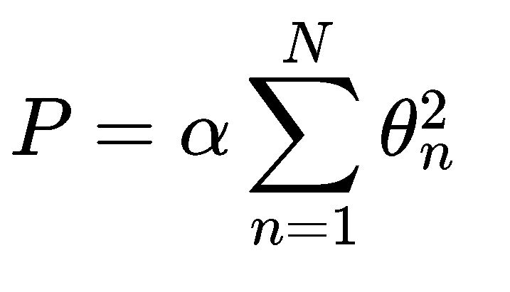
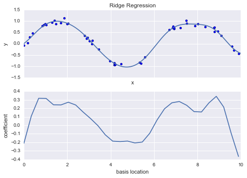

## On calling fit 2nd time on linear regression model object, it forgets about old data.

>* Linear Regression is good not only for prediction, once you have a fitted Linear Regression model you can learn things about relationships between the depended and the independent variables, or in more “ML” language, you can learn the relations between your features and you target value. 
>>* Consider a simple example where we have data about house pricing, we have a bunch of features and the actual price.  
>>* We fit a Linear Regression model and get good results. We can look at the actual weights the model learned for each feature, and if those are significant, we can say that some feature is more important than others, moreover, we can say that the house size, for example, responsible for 50% of the change in the house price and increase in 1 square meter will lead to increase in 10K in house price.  
>* Linear Regression is a powerful tool to learn relationships from data and statisticians use it quite often.

## Adapt non linear relationship
>1. transform the data according to basis functions.
>>a. Polynomial basis functions (Basis Function Regression)
>>>* if fn(x)=x**n, our model becomes a polynomial regression:
>>>* still a linear model—the linearity refers to the fact that the coefficients an never multiply or divide each other. 
```python
import numpy as np
from sklearn.preprocessing import PolynomialFeatures
x = np.array([2, 3, 4])
poly = PolynomialFeatures(3, include_bias=False)
poly.fit_transform(x[:, None])


from sklearn.linear_model import LinearRegression
from sklearn.pipeline import make_pipeline
import matplotlib.pyplot as plt
poly_model = make_pipeline(PolynomialFeatures(7), LinearRegression())
rng = np.random.RandomState(1)
x = 10 * rng.rand(50)
y = np.sin(x) + 0.1 * rng.randn(50)

poly_model.fit(x[:, np.newaxis], y)
yfit = poly_model.predict(xfit[:, np.newaxis])

plt.scatter(x, y)
plt.plot(xfit, yfit);

```


>>b. Gaussian basis functions
>>>* one useful pattern is to fit a model that is not a sum of polynomial bases, but a sum of Gaussian bases.
>>>* hese Gaussian basis functions are not built into Scikit-Learn, but we can write a custom transformer that will create them.

>2. Regularization:
>>a. Issues of Basis Functions -> Overfitting
>>>* The introduction of basis functions into our linear regression makes the model much more flexible, but it also can very quickly lead to over-fitting.
>>b. Why Regularization:
>>>* it would be nice if we could limit such spikes expliticly in the model by penalizing large values of the model parameters. Such a penalty is known as regularization

>>>1. Ridge regression (L2 Regularization): **Smoothens the curve**
>>>>* By penalizing the sum of squares (2-norms) of the model coefficients; in this case, the penalty on the model fit would be:

>>>>* where α is a free parameter that controls the strength of the penalty. This type of penalized model is built into Scikit-Learn with the Ridge estimator

>>>>*  In the limit α→0, we recover the standard linear regression result; in the limit α→∞, all model responses will be suppressed.
>>>>* One advantage of ridge regression in particular is that it can be computed very efficiently—at hardly more computational cost than the original linear regression model.

>>>2. Lasso Regression (L1 Regularization): 
>>>>* involves penalizing the sum of absolute values (1-norms) of regression coefficients

>>>>* due to geometric reasons lasso regression tends to favor sparse models where possible: that is, it preferentially sets model coefficients to exactly zero.