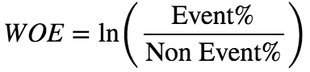
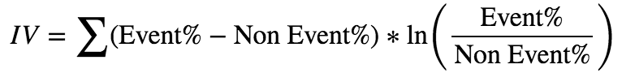
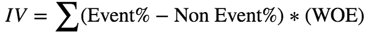

## Weight of evidence and Information Value 
>* Powerful techniques to perform variable transformation and selection
    

    




>* Advantages of WoE:
>>1. Handles missing values
>>2. Handles outliers
>>3. The transformation is based on **logarithmic value of distributions**. This is aligned with the logistic regression output function
>>4. No need for dummy variables
>>5. By using proper binning technique, it can establish monotonic relationship (either increase or decrease) between the independent and dependent variable
    
>* By the way, Logistic Regression (or any ML algorithm) may be used not only in the “Modeling” part but also in “Data Understanding” and “Data Preparation”, imputing is one example for this.
>>* Concepts like Supervised and Unsupervised Learning, Classification vs Regression, Linear vs Non-Linear problems and many more. Also you’re getting an idea about how to prepare your data, what challenges might be there (like imputing and feature selection), how do you measure your model, should you use “Accuracy”, “Precision-Recall”, “ROC AUC”? or maybe “Mean Squared Error” and “Pearson Correlation”?. All those concepts are the most important part of the Data Science process.
>>* Logistic regression is a very powerful algorithm, even for very complex problems it may do a good job. Take MNIST for example, you can achieve 95% accuracy using Logistic Regression only, it’s not a great result, but its more than good enough to make sure you pipeline works.
>>* In this case, Logistic Regression without doing something with the data won’t help us, but if we drop our x2 feature and use x1² instead, it will look like this:
```python
import matplotlib.pyplot as plt
plt.scatter([-2, 2], [0, 0 ], c='b')
plt.scatter([-1, 1], [0, 0 ], c='r')
```
>>>* Of course, this toy example is nothing like real life, and in real life, it will be very hard to tell how exactly you need to change your data so a linear classier will help you, but, if you invest some time in feature engineering and feature selection your Logistic Regression might do a very good job.
 