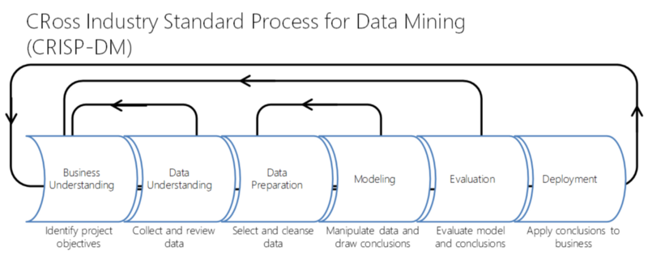
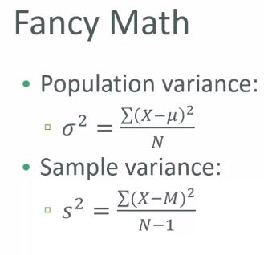
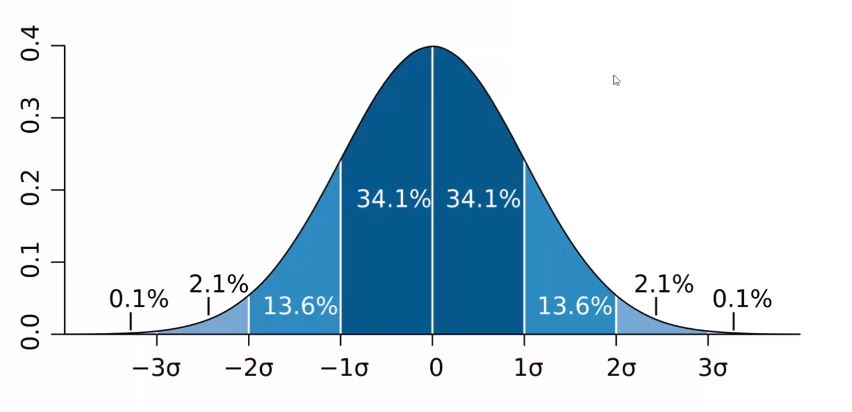
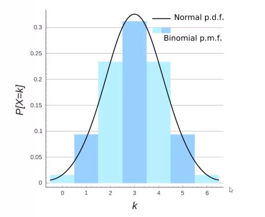
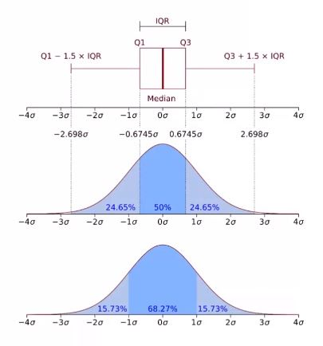
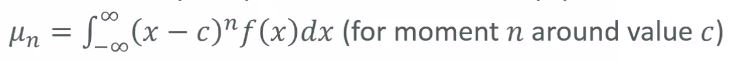
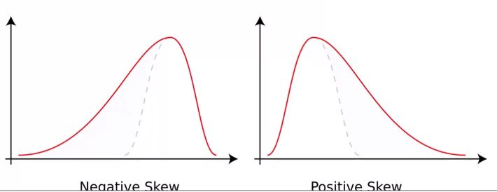
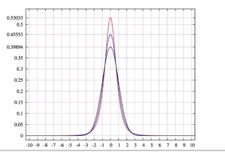
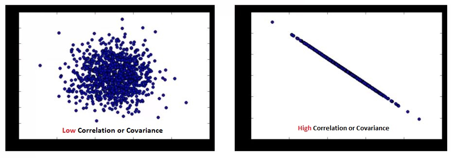

# What is machine learning
    * next natural step of AI - processing, understanding data and reacting intelligence
    * applied statistics - evaluate, summarize data using advance formulaes
    * advanced algorithms - operate on input and provide some output
So to recapitulate  it is the next evolution step for a lot of things

# How machine learning different from traditional programming?
    * Traditionally we built the decision making directly into the program.
        * So if we want to write traditional program to detect a human face, we would write look the eyes, eye-brows, nose, mouth etc.
    * With machine learning, we would write any of such thing in the program. We would build an agent which would look at a set of images at a time and figure out whose face that might be.
        * why now - computers are more relied now a days and a lot of data is getting generated so is at our service to make risk-free strategies to increase the profit.

# Applications:-
    * Machine learning can be applied to nearly all the domains.
    * To exemplify - Electronic Trading, disease diagnosis,
    
# Important Points:
>* Today I know that the most important thing to learn to become a Data Scientist is the pipeline, i.e, the process of getting and processing data, understanding the data, building the model, evaluating the results (both of the model and the data processing phase) and deployment.
>* Pipelining is important in datascience:

# Types of data
>1. Numerical
>>* Quantitative Measurement
>>>* **Discrete** - Integer based, countable number of possible values
>>>* **Continous** - Infinite number of possible values.
>2. Categorical
>>* No inherit mathematical meaning. 
>>* Can represent them compactly by numbers but they must not add any mathematical meaning in it. 
>3. Ordinal
>>* Categorical type data which have some mathematical meaning in it.
>>>* Movie Rating, Juice glass size.

# Mean, Median & Mode
>* Mean - average
>* Median - sort & take average of middle element (**less susceptible to outliers**)  
>* Mode -  most common value (only works with discrete numerical or categorical or ordinal data)

# Variance and Standard Deviation:
>* Both tells about spread of the data, shape & distribution of data-set.
>>* Variance:
>>>* Average of the squared differences from the mean.
>>* Standard Deviation:
>>>* square root of the variance.
>>* Data points tha lie more than 1 std from the mean can be considered as unusual.

# Population vs Sample:
>* Population - complete set of data-set. Population Variance is used.
>* Sample - subset of complete set of data-set. Sample Variance is used.
>>* Sum of squared differences from mean / (n-1)

# Probability Density Function: (continuous data)

# Probability Mass Function: (discrete data)

# Percentiles and moments
>* Percentiles: In the data-set, what's the point at which X% of the values are less than that value? Eg - Income Distribution.
>>* 50 percentile means median
>>* Used in quartile or normal distribution

>* Moments:
>>* Quantitative measures of the shape of a probability density function.
  
>>* Used to measure the shape of the **density function**.
>>>* The first moment is the mean.
>>>* The second moment is the variance.
>>>* Third moment is called **skew**:
>>>>* How lopsided is the distribution?
>>>>* A distribution with a longer tail on the left will be skewed left and have negative skew.

>>>* Fourth Moment is **kurtosis**:
>>>>* How thick is the tail and how sharp is the peak, compared to the normal distribution.
>>>>* **Higher peaks have higher kurtosis**

>>* **Understanding skew: change the normal distribution to be centered around 10 instead of 0, and see what effect that has on the moments. The skew is still near zero; skew is associated with the shape of the distribution, not its actual offset in X. (only mean changes as per the position other nth moment will remain the same)**
 

# Covariance and Correlation 
>* **THE STRENGTH OF THE LINEAR RELATIONSHIP**
>* **Covariance**: Means how two variables vary in tandem from their names.

>* **Measuring covariance**: 
>>1. Convert this two different features vectors to vectors of variance from the mean
>>2. Take a dot product (cosine of the angle b/w them) of two vectors
>>3. Divide by the sample size.
>* **Correlation**: Covariance can take any value that's where correlation comes in which is normalized value of covariance
>>* Just divide the covariance by the std of both variables and that normalizes things.
>>>* Correlation could vary from -1 to 1.
>>>>1. '-1' means perfect inverse correlation
>>>>2. '1' means no correlation
>>>>3. '0' means perfect correlation
>>* The correlation coefficient, r, tells us about the strength and direction of the linear relationship between x and y. 
>>* We introduced Pearson correlation as a measure of the STRENGTH of a relationship between two variables
>>* But any relationship should be assessed for its SIGNIFICANCE as well as its strength.
>>* The strength of the relationship:
>>>* is indicated by the correlation coefficient: r
>>>* but is actually measured by the coefficient of determination: r-square
>>>>* Why r-square and not r (coefficient of correlation)??
>>>>* r vs correlation??

# Condition Probability:
>* Many has bought x item before y item (Amazon Recommendation)

# Bayes Theorem:
>* Comes to rescue: [**MEDICAL PROFESSION**]
>>* Let's say we have a drug test that can accurately identify users of a drug 99% of the time and accurately has a negative result for 99% of non-users. But only 0.3% of the overall population actually uses this drug.
>>>* Event A= Is a user of the drug, Event B=tested positively for the drug.
>>>* Even though P(B|A) is high (99%), it doesn't mean P(A|B) is high. 

# Difference between multi-class classification and multi-label classification (Source: https://en.m.wikipedia.org/wiki/Multi-label_classification)
>* Multi-Class is assigning a single class to a particular combination of independent features.
>* Multi-Lable is assigning more than 1 class to the same combination of independent features.
>>* Although this method of dividing the task into multiple binary tasks may resemble superficially the one-vs.-all (OvA) and one-vs.-rest (OvR) methods for multiclass classification, it is essentially different from both, because a single classifier under binary relevance deals with a single label, without any regard to other labels whatsoever.
>>* Various other transformations exist.
>>>1. **label powerset (LP) transformation** creates one binary classifier for every label combination attested in the training set.
>>>1. **random k-labelsets (RAKEL) algorithm** uses multiple LP classifiers, each trained on a random subset of the actual labels; prediction using this ensemble method proceeds by a voting scheme.
>>*. **Some classification algorithms/models have been adapted to the multi-label task, without requiring problem transformations**
>>>1. **boosting**: AdaBoost.MH and AdaBoost.MR are extended versions of AdaBoost for multi-label data.
>>>2. **k-nearest neighbors**: the ML-kNN algorithm extends the k-NN classifier to multi-label data.[8]
>>>3. **decision trees**: "Clare" is an adapted C4.5 algorithm for multi-label classification; the modification involves the entropy calculations.
>>>>* MMC, MMDT, and SSC refined MMDT, can classify multi-labeled data based on multi-valued attributes without transforming the attributes into single-values. They are also named multi-valued and multi-labeled decision tree classification methods.[10][11][12]
>>>4. **kernel methods**: for vector output
>>>5. **neural networks**: BP-MLL is an adaptation of the popular back-propagation algorithm for multi-label learning 

 