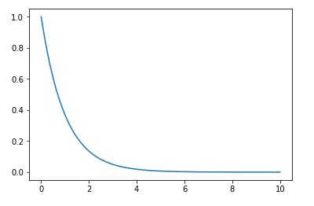
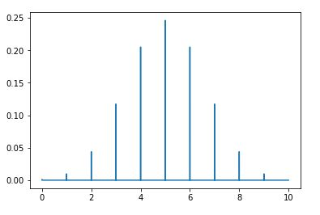

# Numpy Arrays vs Lists: [Less memory, Better performance]
>* Numpy arrays are densely packed arrays of homogeneous type. Python lists, by contrast, are arrays of pointers to objects, even when all of them are of the same type. So, you get the benefits of locality of reference.
>* Also, many Numpy operations are implemented in C, avoiding the general cost of loops in Python, pointer indirection and per-element dynamic type checking. The speed boost depends on which operations you're performing

# Pearson Coefficient
>* **numpy.corrcoef**: Return Pearson product-moment correlation coefficients
```python
import numpy as np
x,y = [], []
np.corrcoef(x, y)[0,1]
```

>* Better option is use **scipy.stats.pearsonr**, which calculates a Pearson correlation coefficient and the p-value for testing non-correlation.
>>* The Pearson correlation coefficient measures the linear relationship between two datasets. Strictly speaking, Pearson’s correlation requires that each dataset be normally distributed. Like other correlation coefficients, this one varies between -1 and +1 with 0 implying no correlation. Correlations of -1 or +1 imply an exact linear relationship. Positive correlations imply that as x increases, so does y. Negative correlations imply that as x increases, y decreases.
>>* The p-value roughly indicates the probability of an uncorrelated system producing datasets that have a Pearson correlation at least as extreme as the one computed from these datasets. The p-values are not entirely reliable but are probably reasonable for datasets larger than 500 or so.
```python
import scipy
x,y = [], []
scipy.stats.pearsonr(x, y)
``` 

# Return a contiguous flattened array. (\\mine: More options for ravel needs to be explored)
```python
import numpy as np
first_array = np.array([[1,2,3,4],[1,2,3,4]])
np.ravel(first_array)
```

# Generate a np-array of floats (\\mine: More options for ravel needs to be explored)
```python
import numpy as np
np.random.randn(9)

my_mean = 9
my_std = 10
no_of_elements = 10
np.random.normal(my_mean, my_std, no_of_elements) # Normal Distribution
```


# Difference between np.random.seed() and np.random.RandomState()
>* If you want to set the seed that calls to np.random... will use, use np.random.seed.
>* If you want to use the class, you must save an instance of the class, initiated with a seed.

# Mean, Median, Mode
```python
import numpy as np

incomes = np.random.normal(27000, 15000, 10000)
np.mean(incomes)


#%matplotlib inline
import matplotlib.pyplot as plt
plt.hist(incomes, 50)
plt.show()


np.median(incomes) #same as mean (as normal distribution was created)


ages = np.random.randint(18, high=90, size=500)
from scipy import stats
stats.mode(ages)


incomes.std()

incomes.var()

```


# Distribution
```python
import numpy as np
import matplotlib.pyplot as plt

values = np.random.uniform(-10.0, 10.0, 100000) # nearly uniform distribution
plt.hist(values, 50)
plt.show()


from scipy.stats import norm        #Normal distribution function
import matplotlib.pyplot as plt
x = np.arange(-3, 3, 0.001)
plt.plot(x, norm.pdf(x)) 

mu = 5.0
sigma = 2.0
values = np.random.normal(mu, sigma, 10000)
plt.hist(values, 50)
plt.show()


from scipy.stats import expon      # Exponential PDF / "Power Law"
import matplotlib.pyplot as plt

x = np.arange(0, 10, 0.001)
plt.plot(x, expon.pdf(x))
```


```python

from scipy.stats import binom     # Binomial Probability Mass Function
import matplotlib.pyplot as plt
import numpy as np

n, p = 10, 0.5
x = np.arange(0, 10, 0.001)
plt.plot(x, binom.pmf(x, n, p))
```


 
 ```python
from scipy.stats import poisson
import matplotlib.pyplot as plt
import numpy as np

mu = 500
x = np.arange(400, 600, 0.5)
plt.plot(x, poisson.pmf(x, mu))
```

# Percentile
```python
import numpy as np
vals = np.random.normal(0, 0.5, 10000)
np.percentile(vals, 50)
```

# Moments:
```python
import numpy as np
vals = np.random.normal(0, 0.5, 10000)
np.mean(vals)

np.var(vals)


import scipy.stats as sp
sp.skew(vals)


sp.kurtosis(vals)

```


# Covariance and correlation
>* Covariance measures how two variables vary in tandem from their means.
>>* For example, let's say we work for an e-commerce company, and they are interested in finding a correlation between page speed (how fast each web page renders for a customer) and how much a customer spends.
>>* numpy offers covariance methods, but we'll do it the "hard way" to show what happens under the hood. Basically we treat each variable as a vector of deviations from the mean, and compute the "dot product" of both vectors. Geometrically this can be thought of as the angle between the two vectors in a high-dimensional space, but you can just think of it as a measure of similarity between the two variables.
>>* First, let's just make page speed and purchase amount totally random and independent of each other; a very small covariance will result as there is no real correlation:

```python
import numpy as np
from pylab import dot, scatter, mean

def de_mean(x):
    xmean = mean(x)
    return [xi - xmean for xi in x]

def covariance(x, y):
    n = len(x)
    return dot(de_mean(x), de_mean(y)) / (n-1)

pageSpeeds = np.random.normal(3.0, 1.0, 1000)
purchaseAmount = np.random.normal(50.0, 10.0, 1000)

scatter(pageSpeeds, purchaseAmount)
covariance(pageSpeeds, purchaseAmount)

# Now we'll make our fabricated purchase amounts an actual function of page speed, making a very real correlation. The negative value indicates an inverse relationship; pages that render in less time result in more money spent:

purchaseAmount = np.random.normal(50.0, 10.0, 1000) / pageSpeeds
scatter(pageSpeeds, purchaseAmount)
covariance (pageSpeeds, purchaseAmount)


# But, what does this value mean? Covariance is sensitive to the units used in the variables, which makes it difficult to interpret. Correlation normalizes everything by their standard deviations, giving you an easier to understand value that ranges from -1 (for a perfect inverse correlation) to 1 (for a perfect positive correlation):
def correlation(x, y):
    stddevx = x.std()
    stddevy = y.std()
    return covariance(x,y) / stddevx / stddevy  #In real life you'd check for divide by zero here

correlation(pageSpeeds, purchaseAmount)


# numpy can do all this for you with numpy.corrcoef. It returns a matrix of the correlation coefficients between every combination of the arrays passed in:
np.corrcoef(pageSpeeds, purchaseAmount) # for all possible correlation

# np.cov for covariance 

```