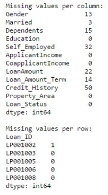
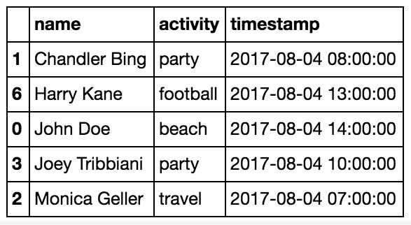
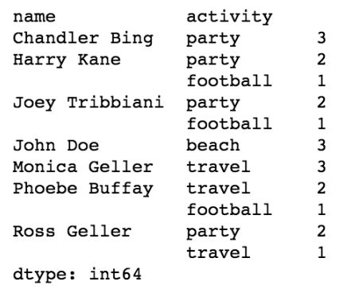
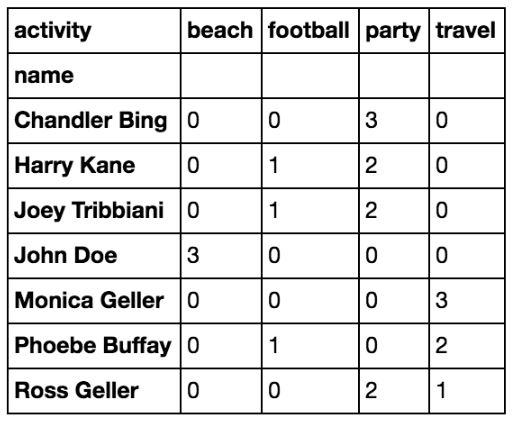
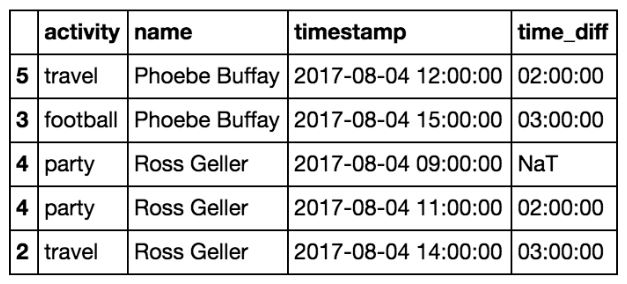
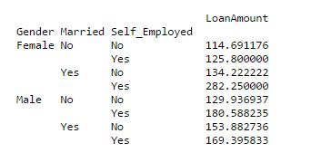
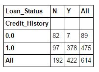
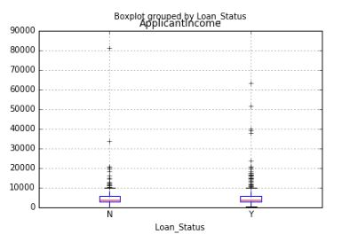
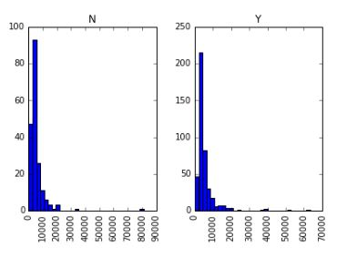
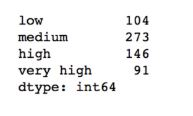

```python

import datetime
import random
import sys

import matplotlib
import matplotlib.pyplot as plt
import numpy as np
import pandas as pd

print(sys.version)
print(pd.__version__)
print(matplotlib.__version__)

# Axis details
drinksbycountry = pd.read_csv("http://bit.ly/drinksbycountry")

```
    
## Drop rows or columns
```python
# del drinksbycountry.continent #didn't work
del drinksbycountry['continent'] # delete column
drinksbycountry.drop('continent', axis=1).head() # drops a column [axis=1]
drinksbycountry.drop(2, axis=0).head() # drops a row (3rd row indexed as 2) [axis=0]

```
    
## mean
```python
drinksbycountry.mean() # default axis=0 --> means across the rows (operation cascade vertically

drinksbycountry.mean(axis='index') #  axis=0 == axis='index'
drinksbycountry.mean(axis=1) # ignores alphabet words - not with current data it is meaningless
drinksbycountry.mean(axis='columns') # same as axis=1

drinksbycountry.index # find index

```
    
## Generating Dates for dummy data
```python
def generate_dates_using_date_time():
    global dummy_dates_pd
    start_date = datetime.datetime(1990, 1, 1)
    end_date = datetime.datetime(2018, 12, 31, 0, 0, 0)
    step = datetime.timedelta(hours=24)
    dummy_dates = []
    format = '%Y-%m-%d %H:%M:%S'
    while start_date < end_date:  
        dummy_dates.append(start_date.strftime(format))
        start_date += step
    random.seed(278)
    return list(map(lambda x: x[:-9], dummy_dates))


dummy_dates_pd = generate_dates_using_date_time()
daily_branch_balance = [random.uniform(5000000, 100000000001) for x in range(len(dummy_dates_pd))]
list_of_tuples = list(zip(dummy_dates_pd, daily_branch_balance))
data_set = pd.DataFrame(data=list_of_tuples, columns=["Date", "BranchBalance"]) # index parameter --> index to rows


rng = pd.date_range(start='1/1/2009', end='12/31/2012', freq='W-MON') # range of dates


# Create dummy data
# set seed
random.seed(111)
# Function to generate test data
def CreateDataSet(Number=1):
    Output = []
    for i in range(Number):
        # Create a weekly (mondays) date range
        rng = pd.date_range(start='1/1/2009', end='12/31/2012', freq='W-MON')
        # Create random data
        data = np.random.choice(range(25, 1000), len(rng))
        # Status pool
        status = [1, 2, 3]
        # Make a random list of statuses
        random_status = [status[random.randint(0, len(status)-1)] for i in range(len(rng))]
        # State pool
        states = ['GA', 'FL', 'fl', 'NY', 'NJ', 'TX']
        # Make a random list of states
        random_states = [states[random.randint(0, len(states)-1)] for i in range(len(rng))]
        Output.extend(zip(random_states, random_status, data, rng))
    return Output

dataset = CreateDataSet(4)
type(dataset) # list of tuples
df = pd.DataFrame(data=dataset, columns=['State','Status','CustomerCount','StatusDate'])
df.info()

```
    
## Creating Data (using Zip and List)
```python
names = ['Bob', 'Jessica', 'Mary', 'John', 'Mel']
births = [968, 155, 77, 578, 973]
BabyDataSet = list(zip(names, births, names)) # list of tuples(each 3 elements)
BabyDataSet = list(zip(names, births))
df = pd.DataFrame(data=BabyDataSet, columns = ['Names', 'Births'])
df = pd.DataFrame(data=BabyDataSet, columns = ['Names', 'Births'], index=['A', 'B', 'C', 'D', 'E' ])

```
    
## Skipping index or header (read or write)
```python
df.to_csv('springfactories.csv', index=False, header = False) #write to csv
pd.read_csv('springfactories.csv', index_col=0) # read from csv mentioning that first column is index
pd.read_csv('springfactories.csv', header=None, index_col=False) #read from csv without header and index column


# Save results to excel
df.to_excel('Lesson3.xlsx', index=False)
df.to_excel('Lesson3.xlsx', sheet_name='Sheet2', index=False)
df.to_excel('Lesson3.xlsx', sheet_name='Sheet3', index=False) #This will overwrite previous excel sheet

df_read_from_excel = pd.read_excel('Lesson3.xlsx', index_col='StatusDate')
df_read_from_excel = pd.read_excel('Lesson3.xlsx', sheet_name='Sheet3', index_col='StatusDate')

```
    
## Column Types
```python
#types of columns in dataframe
df.dtypes
df.Names.dtypes
df.Births.dtypes

```
    
## Sorting
```python
# Ascending (expand the column selection automatically while sorting)
df.sort_values(['Names'])
df.sort_values(['Births'], ascending=False) # Descending
df.sort_values(['Births'], ascending=False).head(1) # returns the details of the record having the maximum number of Births
# Following is failing
# df.sort_values(['Births'], ascending=False)[df['Births']<df['Births'].max()].head(1) # returns the details of the record having the second maximum number of Births

```
    
## Sorting - [[Query special]]
```python
df_sorted_descending = df.sort_values(['Births'], ascending=False)
df_sorted_descending[df_sorted_descending['Births'] < df_sorted_descending['Births'].max()].head(1) # returns the details of the record having the second maximum number of Births
# nth largest number

```
    
###### **head** OR **tail** OR **largest** OR **smallest** OR **max** OR **unique** OR **describe** OR **info**
```python
df.Births.nlargest(5).head(-1) # returns first 4 largest numbers
df.Births.nlargest(5).tail(1) # returns 5th largest numbers
df.Births.nsmallest(5).head(1) # returns 5th smallest numbers


# Return entire record which has 5th largest number
fifth_largest_births_number = df['Births'].nlargest(5).tail(1)
type(fifth_largest_births_number) # returns Series so below we indexed it to get a scaler number for comparision
df[df['Births'] == fifth_largest_births_number[0]].head(1)


df['Births'].max() #It will simply return the value
df['Numbers1'].max()
# df['Numbers1','Births'].max() # Error as df[ ..., ....] is invalid
df[['Numbers1','Births']].max() # Return max of two columns
df.max() # return max for all the columns


# Get unique elements
# df.unique() # doesn't work on dataframe but on series
df['Names'].unique()
df['Names'].describe() # describe gives the count of unique values
df.describe() # describe works on dataframe as well
df.info()
name = df.groupby('Names')
df2 = name.sum()

```
    
## Add new column
```python
# Add new column
df['Numbers1'] = pd.Series(np.random.rand(5), index=df.index)
df['Numbers2'] = pd.Series(np.random.rand(5), index=df.index)
df['Numbers3'] = pd.Series(np.random.choice(66000, 5, replace=True), index=df.index)
# df['Numbers3'] = pd.Series(np.random.choice(1000, 6, replace=True), index=df.index) #6!=5 (expected numbers)

```
    
## Add new row
```python
# Add new row
df2 = df.append(df)

```
    
## Update values in pd.DataFrame()
```python
# update value of a cell in pandas
# df.set_value('C', 'Numbers2', 0.90)
df.at['Numbers2', 'C'] = 0.90
# df.at['E', 'Numbers2'] = 0.90 # Adds a new row and column with Nan except one cell


df.sort_values(['Numbers2', 'Numbers1', 'Numbers3'], ascending=False) # Descending
type(df['Names']) # Series
type(df[['Names']]) # DataFrame

df.plot() # draw all the indexes on x axis and their values on y-axis
df.plot.bar() # plot bar graph
plt.show()

plt.clf()

df['Births'].plot()
# Maximum value in the data set
max_value_of_births = df['Births'].max()
# Name associated with the maximum value
index_satisfying_condition_of_max_births = df['Births'] == max_value_of_births
type(index_satisfying_condition_of_max_births)
name_having_maximum_number_of_births = df['Names'][index_satisfying_condition_of_max_births].values
text_to_display = str(max_value_of_births) + " - " + name_having_maximum_number_of_births
# Add text to graph
plt.annotate(text_to_display, xy=(1, max_value_of_births), xytext=(8, 0), xycoords=('axes fraction', 'data'), textcoords='offset points')
print("The most popular name")
df[df['Births'] == df['Births'].max()]
plt.show()


# Pick random elements from given list
random.seed(500)
random_names = [names[random.randint(low=0,high=len(names))] for i in range(1000)]


df = df.append(df)


# Apply function is used apply a particular function across all the elements in a Series:
df.State.apply(lambda x:x.lower())


#Mask (only grab where status is 1)
df[df.Status==1]

# Convert NJ to NY
mask = df.State == 'NJ'
df['State'].at[mask] = 'NY'
df.State[mask]

# Following wouldn't work
# df.at['State'][mask] = 'FF'
# df.at['State', mask] = 'FF'


# At this point we may want to graph the data to check for any outliers or inconsistencies in the data. We will be using the plot() attribute of the dataframe.
# As you can see from the graph below it is not very conclusive and is probably a sign that we need to perform some more data preparation.
import matplotlib.pyplot as plt
plt.clf()
df_read_from_excel.CustomerCount.plot(figsize=(15,5))
# df.State.plot(figsize=(15,5)) # No Numeric data to plot
# df.CustomerCount.plot() # it will also make the graph but it would be more clumpsy
# df.CustomerCount.plot.bar() # this will also create bar graph but bin size is very small
plt.show()

df_read_from_excel[df_read_from_excel.State == 'NY'].sort_index(axis=0).to_csv("Axis0.csv") # collate all elements of the given index together and then sort it
df_read_from_excel[df_read_from_excel.State == 'NY'].sort_index(axis=1).to_csv("Axis1.csv") # make samples by proper distribution of same indexed rows in different sample spaces
# df_read_from_excel[df_read_from_excel.State == 'NY'].sort_index(axis=2).to_csv("Axis2.csv") # failed - axix can either be 0 or 1

Daily = df.groupby(['State', 'StatusDate']).sum() # reset_index was being used to have two columns in groupby method [df.reset_index().groupby(['State','StatusDate']).sum()]
Daily.head()

Daily.index # usually get multi-index after grouping operation
Daily.index.levels[0] # get first level of index
Daily.index.levels[1] # get 2nd level of index


Daily.loc['FL'].plot()
plt.show()
Daily.loc['GA'].plot()
Daily.loc['NY'].plot()
Daily.loc['TX'].plot();

plt.clf()
Daily.loc['FL']['2012':].plot()
Daily.loc['GA']['2012':].plot()
Daily.loc['NY']['2012':].plot()
Daily.loc['TX']['2012':].plot();
plt.show()


# We will assume that per month the customer count should remain relatively steady. Any data outside a specific range in that month will be removed from the data set. The final result should have smooth graphs with no spikes.
# StateYearMonth - Here we group by State, Year of StatusDate, and Month of StatusDate.
# Daily['Outlier'] - A boolean (True or False) value letting us know if the value in the CustomerCount column is ouside the acceptable range.
# We will be using the attribute transform instead of apply. The reason is that transform will keep the shape(# of rows and columns) of the dataframe the same and apply will not. By looking at the previous graphs, we can realize they are not resembling a gaussian distribution, this means we cannot use summary statistics like the mean and stDev. We use percentiles instead. Note that we run the risk of eliminating good data.
# Calculate Outliers
StateYearMonth = Daily.groupby([Daily.index.get_level_values(0), Daily.index.get_level_values(1).year, Daily.index.get_level_values(1).month])
Daily['Lower'] = StateYearMonth['CustomerCount'].transform( lambda x: x.quantile(q=.25) - (1.5*x.quantile(q=.75)-x.quantile(q=.25)) )
Daily['Upper'] = StateYearMonth['CustomerCount'].transform( lambda x: x.quantile(q=.75) + (1.5*x.quantile(q=.75)-x.quantile(q=.25)) )
Daily['Outlier'] = (Daily['CustomerCount'] < Daily['Lower']) | (Daily['CustomerCount'] > Daily['Upper'])

# Remove Outliers
Daily = Daily[Daily['Outlier'] == False]


# We create a separate dataframe named ALL which groups the Daily dataframe by StatusDate. We are essentially getting rid of the State column. The Max column represents the maximum customer count per month. The Max column is used to smooth out the graph.
# Combine all markets

# Get the max customer count by Date (Month & Year] adjacent to existing data (so that we can see the difference as well]
ALL = pd.DataFrame(Daily['CustomerCount'].groupby(Daily.index.get_level_values(1)).sum())
ALL.columns = ['CustomerCount'] # rename column
# Group by Year and Month
YearMonth = ALL.groupby([lambda x: x.year, lambda x: x.month])
# What is the max customer count per Year and Month
ALL['Max'] = YearMonth['CustomerCount'].transform(lambda x: x.max())
ALL.head()

# Get the max customer count by Date [Month across all the years]
ALL = pd.DataFrame(Daily['CustomerCount'].groupby(Daily.index.get_level_values(1)).sum())
ALL.columns = ['CustomerCount'] # rename column
# Group by Year and Month
YearMonth = ALL.groupby([lambda x: x.month]) # maximum in a month
# What is the max customer count per Year and Month
ALL['Max'] = YearMonth['CustomerCount'].transform(lambda x: x.max())
ALL.head()

ALL.groupby([lambda x: x.month]).max() #Find max of all the months (Januaries or Febuary etc]
ALL.groupby([lambda x: x.month]).mean() #Find mean of all the months (Januaries or Febuary etc]
ALL.to_csv('All.csv')


# There is also an interest to gauge if the current customer counts were reaching certain goals the company had established. The task here is to visually show if the current customer counts are meeting the goals listed below. We will call the goals BHAG (Big Hairy Annual Goal).
    # 12/31/2011 - 1,000 customers
    # 12/31/2012 - 2,000 customers
    # 12/31/2013 - 3,000 customers
# date_range:  date_range(start=None, end=None, periods=None, freq='D', tz=None, normalize=False, name=None, closed=None)
# Create the BHAG dataframe
data = [1000,2000,3000]
idx = pd.date_range(start='12/31/2011', end='12/31/2013', freq='A')
BHAG = pd.DataFrame(data, index=idx, columns=['BHAG'])
BHAG


# Combine the BHAG and the ALL data set
combined = pd.concat([ALL,BHAG], axis=0)
combined = combined.sort_index(axis=0)
combined.tail()


fig, axes = plt.subplots(figsize=(12, 7))
combined['BHAG'].fillna(method='pad').plot(color='green', label='BHAG')
combined['Max'].plot(color='blue', label='All Markets')
plt.legend(loc='best');


# The mapping can be specified many different ways:
#
# Type-1: A Python function, to be called on each of the axis labels.
# Type-2: A list or NumPy array of the same length as the selected axis.
# Type-3: A dict or Series, providing a label -> group name mapping.
# Type-4: For DataFrame objects, a string indicating a column to be used to group. Of course df.groupby('A') is just syntactic sugar for df.groupby(df['A']), but it makes life simpler.
# Type-5: For DataFrame objects, a string indicating an index level to be used to group.
# Type-6: A list of any of the above things

# A string passed to groupby may refer to either a column or an index level. If a string matches both a column name and an index level name then a warning is issued and the column takes precedence. This will result in an ambiguity error in a future version.
df_gb = data_set.groupby(['Date'])  # Creation of groupby object
df_gb = data_set.groupby('Date')  # Equivalent to above
print(df_gb)
type(df_gb)

# Type-1: A Python function, to be called on each of the axis labels.
def get_letter_type(letter):
    if letter.lower() in 'aieou':
        return 'vowel'
    else:
        return 'consonant'
df_gb_1 = data_set.head().groupby(get_letter_type, axis=1)


# data_set.pivot()


```

# Looping with iterrows()
# Better looping using the apply method


# Boolean indexing
>* rows where Gender=Female & Education=NotGraduate & LoanStatus=Y (columsn  = Gender, Education, Loan_Status)


```python

data.loc[(data["Gender"]=="Female") & (data["Education"]=="Not Graduate") & (data["Loan_Status"]=="Y"), ["Gender","Education","Loan_Status"]]

```

# Apply function
>* playing with data and creating new variables

```python
#Create a new function:
def num_missing(x):
  return sum(x.isnull())

#Applying per column:
print("Missing values per column:")
print(data.apply(num_missing, axis=0)) #axis=0 defines that function is to be applied on each column

#Applying per row:
print("\nMissing values per row:")
print(data.apply(num_missing, axis=1).head()) #axis=1 defines that function is to be applied on each row

```


# Ufuncs ( better than apply method)
>>* Note that apply is just a little bit faster than a python for loop! 
>>* That’s why it is most recommended using pandas builtin ufuncs for applying preprocessing tasks on columns (if a suitable ufunc is available for your task). 
>>* Ufuncs, are special functions (based on numpy library) implemented in C and that’s why they are highly efficient.
>>>* Among the useful ufuncs we will mention are: .diff, .shift, .cumsum, .cumcount, .str commands (works on strings), .dt commands (works on dates) and many more.
>>>>* **Use-Case #1**: WHO IS THE MOST FUN PERSON IN THE DATA SET

```python

# String commands
df['name'] = df.name.str.split(" ", expand=True)
# In addition you can clean any string column efficiently using .str.replace and a suitable regex.


# Groupby and value_counts
###### Groupby is a very powerful pandas method. 
###### You can group by one column and count the values of another column per this column value using value_counts.

df.groupby('name')['activity'].value_counts()


# Unstack
###### Unstack switches the rows to columns to get the activity counts as features. 
###### By doing unstack we are transforming the last level of the index to the columns. 
###### All the activities values will now be the columns of a the dataframe and when a person has not done a certain activity this feature will get Nan value. 
###### Fillna fills all these missing values (activities which were not visited by the person) with 0.

df.groupby('name')['activity'].value_counts().unstack().fillna(0)


# groupby, diff, shift, and loc
###### Knowing the time differences between person activities can be quite interesting for predicting who is the most fun person.
###### The most straight forward way to calculate the time differences would be to groupby the person name and them calculate the difference on the timestamp field using diff():

df = df.sort_values(by=['name','timestamp'])
df['time_diff'] = df.groupby('name')['timestamp'].diff()


###### If you have a lot of data and you want to save some time (this can be about 10 times faster depends on your data size) you can skip the groupby and just do the diff after sorting the data and then deleting the first row of each person which is not relevant:

df = df.sort_values(by=['name','timestamp'])
df['time_diff'] = df['timestamp'].diff()
df.loc[df.name != df.name.shift(), 'time_diff'] = None


# BTW — the useful .Shift command shift all the column down per one space, so we can see on which row this column is changing by doing this: df.name!=df.name.shift().


# Cumcount and Cumsum : cumulative count and cumulative sum
df = df.sort_values(by=['name','timestamp'])
df2 = df[df.groupby('name').cumcount()==1] # 1st activity of each person
df2 = df[df.groupby('name').cumcount()==2] # 2nd activity of each person

# Cumsum is just a cummulative summary of a numeric cell. For example you can add the money the person spend in each activity as an additional cell and then summarize the money spent by a person at each time of the day using:
df = df.sort_values(by=['name','timestamp'])
df['money_spent_so_far'] = df.groupby('name')['money_spent'].cumsum()

```
######GroupingExample- 


######Unstack- 


######diff- 



# Imputing missing files:


```python

from scipy.stats import mode
mode(data['Gender']) 

# This returns both mode and count. 
# Remember that mode can be an array as there can be multiple values with high frequency.
mode(data['Gender']).mode[0]

#Impute the values:
data['Gender'].fillna(mode(data['Gender']).mode[0], inplace=True)
data['Married'].fillna(mode(data['Married']).mode[0], inplace=True)
data['Self_Employed'].fillna(mode(data['Self_Employed']).mode[0], inplace=True)

```


# Pivot Table:
>* 

```python

#Determine pivot table
impute_grps = data.pivot_table(values=["LoanAmount"], index=["Gender","Married","Self_Employed"], aggfunc=np.mean)
print(impute_grps)

```




# Multi-indexing:
>* Each index is made up of a combination of 3 values. 
>* This is called Multi-Indexing. It helps in performing operations really fast.


# Crosstab:
>* we can validate some basic hypothesis. 
>* For instance, in this case, “Credit_History” is expected to affect the loan status significantly. 
>* This can be tested using cross-tabulation as shown below:


```python

pd.crosstab(data["Credit_History"],data["Loan_Status"],margins=True)

```



>* Percentages can be more intuitive in making some quick insights. We can do this using the apply function:

```python

def percConvert(ser):
  return ser/float(ser[-1])
  pd.crosstab(data["Credit_History"],data["Loan_Status"],margins=True).apply(percConvert, axis=1)

```


# Merge DataFrames


```python

prop_rates = pd.DataFrame([1000, 5000, 12000], index=['Rural','Semiurban','Urban'],columns=['rates'])
print(prop_rates)

data_merged = data.merge(right=prop_rates, how='inner',left_on='Property_Area',right_index=True, sort=False)
data_merged.pivot_table(values='Credit_History',index=['Property_Area','rates'], aggfunc=len)

```

# Sorting DataFrames


```python

data_sorted = data.sort_values(['ApplicantIncome','CoapplicantIncome'], ascending=False)
data_sorted[['ApplicantIncome','CoapplicantIncome']].head(10)

```

# Plotting (Boxplot & Histogram)


```python

import matplotlib.pyplot as plt
# %matplotlib inline
data.boxplot(column="ApplicantIncome",by="Loan_Status")

data.hist(column="ApplicantIncome",by="Loan_Status",bins=30)

```




# Cut function for binning
>* Sometimes numerical values make more sense if clustered together. 
>* For example, if we’re trying to model traffic (#cars on road) with time of the day (minutes). 
>* The exact minute of an hour might not be that relevant for predicting traffic as compared to actual period of the day like “Morning”, “Afternoon”, “Evening”, “Night”, “Late Night”. 
>* Modeling traffic this way will be more intuitive and will avoid overfitting.

```python

#Binning:
def binning(col, cut_points, labels=None):
  #Define min and max values:
  minval = col.min()
  maxval = col.max()

  #create list by adding min and max to cut_points
  break_points = [minval] + cut_points + [maxval]

  #if no labels provided, use default labels 0 ... (n-1)
  if not labels:
    labels = range(len(cut_points)+1)

  #Binning using cut function of pandas
  colBin = pd.cut(col,bins=break_points,labels=labels,include_lowest=True)
  return colBin

#Binning age:
cut_points = [90,140,190]
labels = ["low","medium","high","very high"]
data["LoanAmount_Bin"] = binning(data["LoanAmount"], cut_points, labels)
print(pd.value_counts(data["LoanAmount_Bin"], sort=False))

```



# Coding nominal data
>* We find a case where we’ve to modify the categories of a nominal variable. 
>* This can be due to various reasons:
>>1. Some algorithms (like Logistic Regression) require all inputs to be numeric. So nominal variables are mostly coded as 0, 1….(n-1)
>>2. Sometimes a category might be represented in 2 ways. For e.g. temperature might be recorded as “High”, “Medium”, “Low”, “H”, “low”. Here, both “High” and “H” refer to same category. Similarly, in “Low” and “low” there is only a difference of case. But, python would read them as different levels.
>>3. Some categories might have very low frequencies and its generally a good idea to combine them.

```python

#Define a generic function using Pandas replace function
def coding(col, codeDict):
  colCoded = pd.Series(col, copy=True)
  for key, value in codeDict.items():
    colCoded.replace(key, value, inplace=True)
  return colCoded
 
#Coding LoanStatus as Y=1, N=0:
print('Before Coding:')
print(pd.value_counts(data["Loan_Status"]))
data["Loan_Status_Coded"] = coding(data["Loan_Status"], {'N':0,'Y':1})
print('\nAfter Coding:')
print(pd.value_counts(data["Loan_Status_Coded"]))

```

