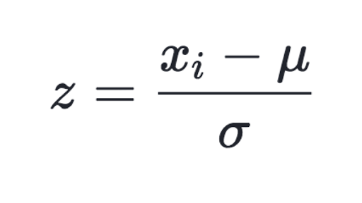
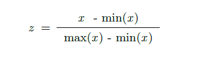
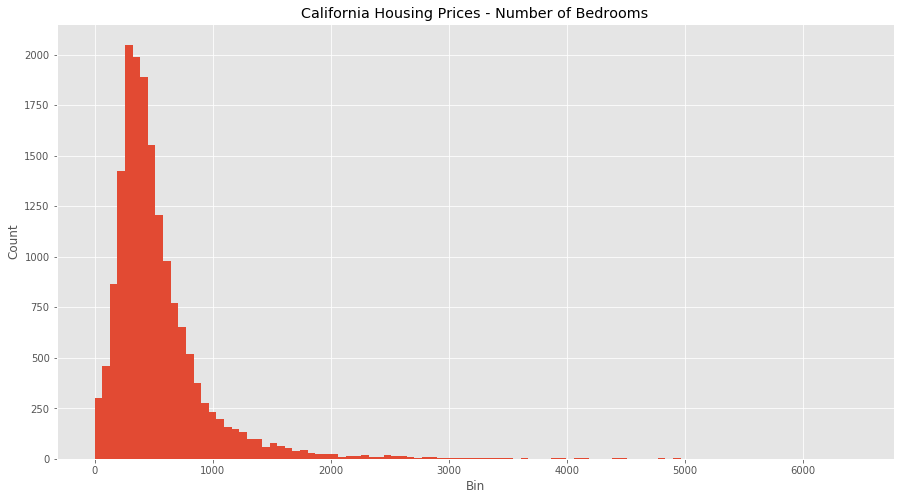
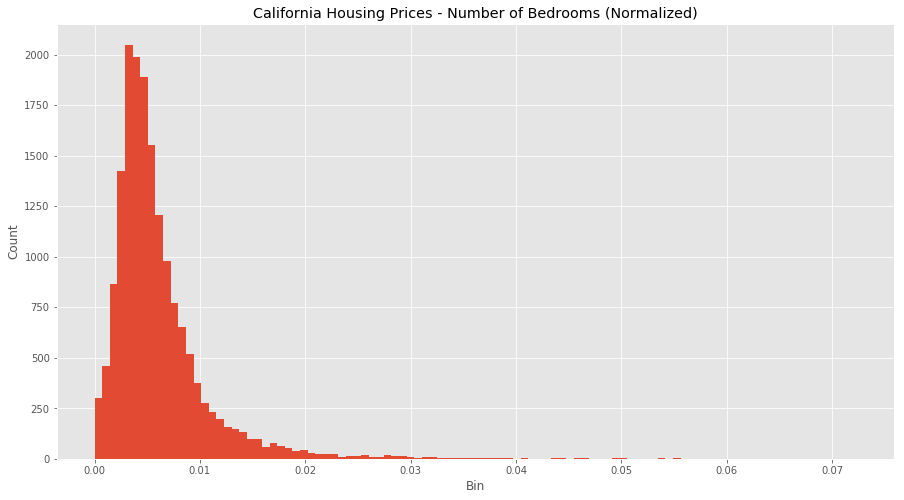

# Standardize


>* Here your data Z is rescaled such that μ = 0 and 𝛔 = 1, and is done through this formula:

>* Why we do standardization?
>>1. Compare features that have different units or scales
>>>>* Consider our data above with housing and income, both have different scales and units. We can start to compare these features and use them in our models once we have standardized them.

```python

from sklearn import preprocessing
# Get column names first
names = df.columns
# Create the Scaler object
scaler = preprocessing.StandardScaler()
# Fit your data on the scaler object
scaled_df = scaler.fit_transform(df)
scaled_df = pd.DataFrame(scaled_df, columns=names)

```

>>>>>* Looks like we’ve adjusted for all the outlier values in bedrooms and income, and we have a much more normal distribution for each feature. It’s not perfect, but the data is in much better shape than it was when we ran our normalization. It seems because of the large difference in scales and units, standardizing is a better transformation for this data set.

>>2. Standardizing tends to make the training process well behaved because the numerical condition of the optimization problems is improved.
>>>>>* Consider if you’re doing PCA, the output can only be interpreted correctly when the features have first been centred around their means. Again, understanding what you want to achieve and the model you’ll be using, are necessary conditions to understanding different transformations decisions.
>>>>>* However, if you do standardize your data be warned you might be discarding some information. If that information is not needed, the process can be helpful else it will impede your results.


# Normalization
>* Here your data Z is rescaled such that any specific z will now be 0 ≤ z ≤ 1, and is done through this formula:



```python

from sklearn import preprocessing
import numpy as np
# Get dataset
df = pd.read_csv("https://storage.googleapis.com/mledudatasets/california_housing_train.csv", sep=",")
# Normalize total_bedrooms column
x_array = np.array(df['total_bedrooms'])
normalized_X = preprocessing.normalize([x_array])

```


## Why would we normalize in the first place?
>1. Normalization makes training less sensitive to the scale of features, so we can better solve for coefficients.
>>>* Consider the dataset above of housing prices in California, which have features such as the number of bedrooms and the median household income. Each have different units and scales, so consider these feature attributes when going through this article.



>2. The use of a normalization method will improve analysis from multiple models.
>>>* Additionally, if we were to use any algorithms on this data set before we normalized it would be hard (potentially not possible) to converge the vectors because of the scaling issues. Normalization makes the data better conditioned for convergence.

>3. Normalizing will ensure that a convergence problem does not have a massive variance, making optimization feasible


```python

sklearn.preprocessing.normalize(X, norm='l2', axis=1, copy=True, return_norm=False)

```


# But wait … sometimes you might not want to normalize your data.

### The data provided is proportional, so normalizing might not provide correct estimators. Or, the scale between your data features does matters so you want to keep in your dataset. You need to think about your data, and understand if the transformations you’re applying are in line with the outcomes you’re searching for.
  
  
# Bonus Thing: Binning
>* Consider the latitude feature in our dataset, which has a geo point of the area in question. How would we think about standardizing or normalizing this? We could do either, but there is a third alternative: binning.


```python

# Create range for your new columns
lat_range = zip(xrange(32, 44), xrange(33, 45))
new_df = pd.DataFrame()
# Iterate and create new columns, with the 0 and 1 encoding
for r in lat_range:
        new_df["latitude_%d_to_%d" % r] = df["latitude"].apply(
            lambda l: 1.0 if l >= r[0] and l < r[1] else 0.0)
new_df

```

