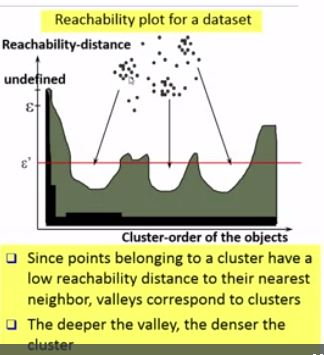

# Types:
>* Hierarchical
>* Spectral
>* Partitional
>* Mixtures
>* Density-based

# DB-Scan

>* Method #1:
>>* There is no general way of choosing minPts. It depends on what you want to find. A low minPts means it will build more clusters from noise, so don't choose it too small.
>>* For epsilon, there are various aspects. It again boils down to choosing whatever works on this data set and this minPts and this distance function and this normalization. You can try to do a knn distance histogram and choose a "knee" there, but there might be no visible one, or multiple.
>>* OPTICS is a successor to DBSCAN that does not need the epsilon parameter (except for performance reasons with index support, see Wikipedia). It's much nicer, but I believe it is a pain to implement in R, because it needs advanced data structures (ideally, a data index tree for acceleration and an updatable heap for the priority queue), and R is all about matrix operations.
>>* Naively, one can imagine OPTICS as doing all values of Epsilon at the same time, and putting the results in a cluster hierarchy.
>>* The first thing you need to check however - pretty much independent of whatever clustering algorithm you are going to use - is to make sure you have a useful distance function and appropriate data normalization. If your distance degenerates, no clustering algorithm will work.

>* Method #2:
>>* One common and popular way of managing the epsilon parameter of DBSCAN is to compute a k-distance plot of your dataset. Basically, you compute the k-nearest neighbors (k-NN) for each data point to understand what is the density distribution of your data, for different k. the KNN is handy because it is a non-parametric method. Once you choose a minPTS (which strongly depends on your data), you fix k to that value. Then you use as epsilon the k-distance corresponding to the area of the k-distance plot (for your fixed k) with a low slope.

https://stackoverflow.com/questions/12893492/choosing-eps-and-minpts-for-dbscan-r/
>* DB-Scan is more sensitive to paramaters
>* Higher density points should be processed first

# MeanShift
>* discover “blobs” in a smooth density of samples.

# Bag of words vs TF-IDF:
>* Issues 
>>* BoW give all words equal importance.
>>* BoW doesn't preserve semantic information
>* Solution"
>>* Tf-idf (beautiful -> ugly)

 

